```{r, include = FALSE}
pacman::p_load(tidyverse, 
               knitr, 
               lubridate, 
               kableExtra,
               xaringan,
               xaringanExtra)

knitr::opts_chunk$set(echo = FALSE, 
                      fig.align = "center", 
                      cache = TRUE,
                      out.width="1000px"
)

Sys.setlocale(locale = "da_DK.UTF-8")

xaringanExtra::use_tile_view()
```

```{r xaringan-themer, include=FALSE, warning=FALSE}
library(xaringanthemer)

style_mono_accent(
  # Colors
  base_color = "#8b2325",
  text_color = "#000000", 
  link_color = "#808080", 
  text_bold_color = "#8b2325",
  title_slide_background_color = "#8b2325",
  title_slide_text_color = "#FFFFFF",
  colors = c("white" = "#FFFFFF", "black" = "#000000"),
  # Fonts
  text_bold_font_weight = "normal",
  text_font_base = "sans-serif",
  text_font_google = google_font("Metrophobic"),
  code_font_google = google_font("Metrophobic"),
  header_font_google = google_font("Metrophobic"),
  base_font_size = "16pt",
  text_font_size = "16pt",
  code_font_size = "16pt",
  code_inline_font_size = "16pt",
  header_h1_font_size = "30pt",
  header_h2_font_size = "20pt",
  header_h3_font_size = "16pt"
)
```

# Velkommen til holdningsdannelse

**Hvad er det, vi gerne vil forstå og forklare?**

- **Partivalg** - og hvorfor vi foretrækker vidt forskellig politik på spørgsmål som **økonomi, skat, uddannelse, indvandring**?

--

- Hvorfor var **vaccineskepsis** udbredt i bestemte segmenter af befolkningen?

--

- **Klimaforandringer** - bør vi satse på en generel CO2-afgift, ny teknologi, livsstilsændringer? 

--

- Hvorfor er der endda nogen, der **slet ikke tror på menneskeskabte klimaforandringer**?
    - *omkring 1/3 i USA - 1/11 i EU - 1/17 i DK*

--

***

&rarr; Vi vil prøve at forstå vores skøre onkler, vores politiske meningsfæller og "modstandere" og os selv

- Hvor kommer vores holdninger til politik fra?

---

# Velkommen til holdningsdannelse 

Og så vil gerne kunne forstå **meningsmålinger** og **"den offentlige mening"** **&darr;** 

```{r imgpublic, out.width="55%", fig.cap="(Bayes & Druckman 2021)"}
include_graphics("media/po.png")
```

---

# Hvorfor er det vigtigt at studere holdningsdannelse?

--

- Borgernes politiske holdninger er helt centrale i **demokratiet**

    - **Demokrati** som metode til at samle "folkets" individuelle holdninger og styre derefter

--

- **Meningsmålinger og spørgeskemaer** som metode til at indsamle viden 

    - flere og flere målinger i den offentlige debat

--

- Samfundets sammenhængskraft (polarisering, ekkokamre, osv.)

--

- Vigtigt i sig selv at forstå, hvordan mennesker ser på verden

---

# Den naive version: meningsmålinger som objektiv "temperaturmåling"

.pull-left[

1. Vi har klare, gennemtænkte holdninger og præferencer til de fleste emner

    - Fast forankret i materiel egen-interesse

2. 1000 personer ringes op af Gallup og spørges om emne

    - "Støtter du afskaffelsen af Store Bededag?"

3. Respondenterne finder deres eksisterende præference frem og informerer Gallup: 

    - Ja! eller Nej!

4. Gallup opsummerer alle svarene som "den offentlige mening" og medierne fortolker &rarr; 

]

.pull-right[
```{r imgtermo, out.width="70%"}

```
]

---

# 75% imod = "Stort nej tak"

```{r, out.width="60%", fig.cap='Epinion (https://bit.ly/3XFaANE)'}
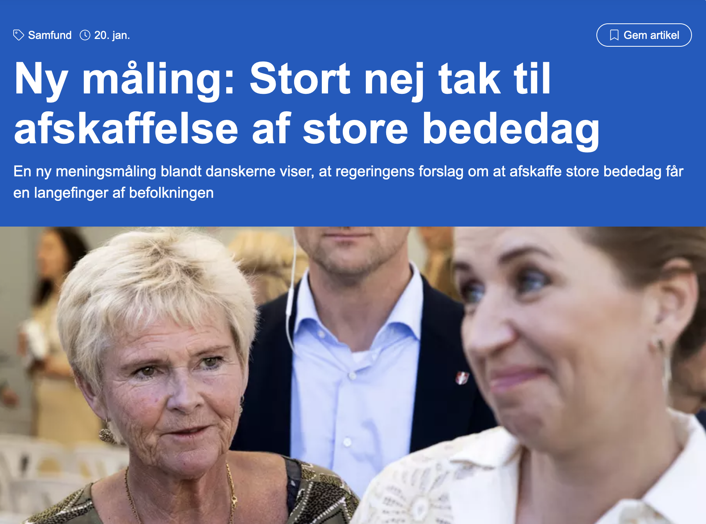
```

---

# Over- og tilbageblik

<br>

- **Mikroniveau** og makroniveau

- Politisk **adfærd**

- Masser af tråde til andre uger, bl.a. 

    - **politiske værdier** sidste uge 
    - **medier** senere
    
---


# Ugens pensum

<br>

**Hvad og hvorfor?**

1. Zaller (1992), kap. 2-3 &rarr; klassiker, overblik, godt udgangspunkt

2. Tesler (2018) &rarr; analyse af klimaholdninger i USA med Zaller-framework

3. Andersen & Hansen (2021) "Klimavalget" &rarr; klimaholdninger i DK og vigtige begreber

<br>

*Mange siders læsning til denne uge &rarr; langt færre til næste uge*

---
class: middle

# Dagens hovedpointe: en politisk "holdning" er det kontekstafhængige resultat af et ægteskab mellem *information* (især elitekommunikation) og *prædispositioner* til at modtage og acceptere informationen

---

## Dagens hovedpointe: en politisk "holdning" er det kontekstafhængige resultat af et ægteskab mellem *information* (især elitekommunikation) og *prædispositioner* til at modtage og acceptere informationen

```{r, out.width="80%"}
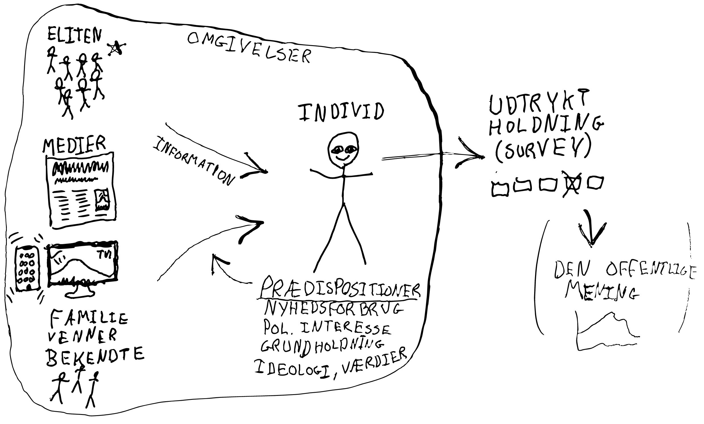
```

---
class: middle

<br><br>

.left-column[
```{r, out.width="100%"}
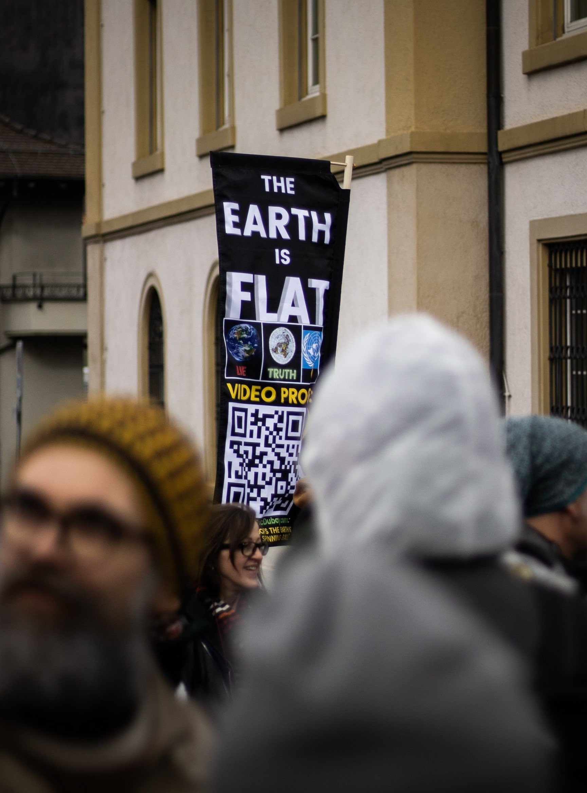
```
]

.right-column[
# Plan for resten af forelæsningen

1. Hvad er en holdning?

2. Zaller og "RAS-modellen" - **dagens hovedfokus**

3. Lidt om de to andre tekster, klimaholdninger og relateret teori

4. Opsamling
]

---

# Holdninger: attitudes, opinions, preferences

--

.pull-left[

- "An **attitude** is a predisposition to *respond in a favorable or unfavorable manner* with respect to a given **attitude object**" (Oskamp & Schultz, 2005)

- "[A]n **attitude is not behavior**, not something that a person does; rather it is a **preparation for behavior**" (Oskamp & Schultz, 2005)

]

.pull-right[
<br>
```{r, out.width="62%", fig.cap='Holdningens ABC (tanker, følelser, handling). Teoretisk forældet, men pædagogisk.'}
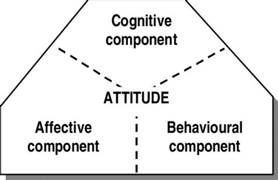
```
]

--

- **Opinions**

- **Præferencer** er økonomernes foretrukne term<br>(implicerer ofte rational choice, men anvendes også synonymt)

<!-- Holdninger, holdnings*dannelse* og holdnings*påvirkning* -->

---

# Beslægtede begreber

<br>

- **Holdning**, mening, indstilling, overbevisning _(opinion, attitude)_

- **Præference**, position, støtte _(policy preference, position, support)_

- **Opfattelse**, tanker, vurdering _(belief, perception, thoughts, evaluation)_

- **Adfærd**, beslutninger _(behavior, decisions)_

- **Affekt** (følelse af like/dislike), tillid, approval ratings

<br>

***

__&rarr; i dag forsimpler vi det til **"holdninger"** i bred forstand__

---

# Zaller: What is an opinion?

--

Efter 7 siders diskussion:

> "I abandon the conventional but implausible view that citizens typically possess __"true attitudes"__ on every issue about which a pollster may happen to inquire, and instead propose a model of how __individuals construct opinion reports__ in response to the particular stimuli that confront them" (s. 35)

<br>&rarr; behov for procesorienteret model for **svar på holdningsspørgsmål** 

--

- Ingen konsensusdefinition

- Løs definition:<br>__tanker, følelser og evalueringer, der vedrører enkeltstående politiske spørgsmål, emner, personer, osv.__<br>(klima, uddannelse, skat, Mette Frederiksen)

- Omfatter *ikke* værdier, ideologi, grundholdninger, mv.

???

Zallers problemer: Non-attitudes, ustabilitet, ikke-krystalliseret, effekter af spørgsmålformulering (og framing) mv.

---

# Den offentlige mening (public opinion)

.pull-left[

- Borgernes **aggregerede holdninger** til politiske spørgsmål

- __Når aggregerede individuelle holdninger "taler" et tydeligt sprog kan det være en afgørende faktor i **politik**__
    - "*a public opinion that is truly public*"<br>(Carmines & Huckfeldt 1998)
    - "*a force called Public Opinion*"<br>(Lippmann 1922)
    
- Ikke kun **mikroniveau** &rarr; "den offentlige mening" som __institution__, der presser beslutningstagere


]

--

.pull-right[

Mange **definitioner**: 

> "the shared opinions and attitudes of large groups of people (sometimes called 'publics') who have particular characteristics in common" (Oskamp & Schultz 2005: 16).

> "combined personal opinions of adults towards issues of relevance to government" (Erikson et al. 1991: 13)

> "opinions held by private persons which governments find it prudent to heed" (Key 1961: 14)

> "complex of beliefs expressed by a significant number of persons on an issue of public importance" (Hennessy 1967: 97-98)

]

---
class: title-slide, middle, center

# Zaller og RAS-modellen

.pull-left[
```{r zallerimg, out.width="70%"}

```
]
.pull-right[
```{r zallerbook, out.width="50%"}
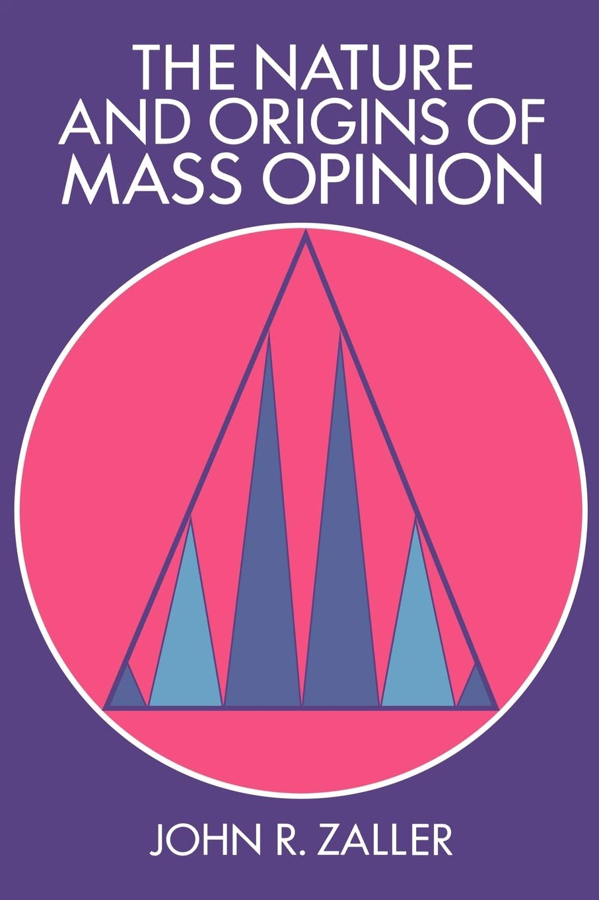
```
]

Udkom for 31 år siden (1992) og er citeret mere end 15.000 gange

Generel, universel, velskrevet teori om holdningsdannelse

---

# Baggrund: Converse og ustabile (ikke-)holdninger

> ”Large portions of an electorate simply do not have meaningful beliefs” (Converse 1964)

--

- Endnu større **klassikere**

--

- Converse et al. registrerede, at folks "holdninger" er **ustabile** og **modstridende**, og at **viden om politik** er meget begrænset

--

- Folk har generelt ikke egentlige politiske holdninger, men svarer tilfældigt - gætter! - på de spørgsmål de bliver stillet

--

.pull-left[

- **Ikke-holdninger** (non-attitudes) og meningsløse pseudo-holdninger er udbredte

- Også stor **ustabilitet** over tid (≠ holdningsskift)

- Folk er "rationally ignorant" (Downs 1957) 

]
.pull-right[
```{r, out.width="60%"}

```
]

???

__*Et eksempel*__

Amerikansk survey (Bishop et al. 1986): 

- Ca. 33% har en holdning til **The Public Affair Act of 1975**

Dansk survey fra 2005:

- Ca. 7% har en holdning til **Lovforslag 712**

- Ca. 36% har en holdning til **Nytårspakken** 

.center[**Problemet: de findes ikke**]

---

# Zallers udgangspunkt og nøglebegreber

<br>

- Zaller vil trække på nyere indsigter fra **psykologien** og skabe en teori om **holdnings_dannelse_**

<br>
--

## Nøglebegreber

1. **Information** (elite-diskurs, kommunikation, beskeder)

2. **Politisk bevidsthed** (kognitivt engagement med emnet, viden, opmærksomhed)

3. **Politiske prædispositioner** (grundholdninger, værdier, ideologi) 

4. **Overvejelser** (*considerations*) - alt hvad der kan være relevant for en holdning

5. **Holdningsudsagn**

---

# Nøglebegreb 1: Information og elitediskurs

- Vi eksponeres non-stop for information fra vores omgivelser

    - Den information som er **politisk relevant** stammer som regel fra eliterne

    - = ethvert budskab med potentiel relevans

--

- Den væsentligste informationskilde: **Nyhedsstrømmen og medierne**

    - Men også mere **direkte kommunikation** fra eliter (politikere, eksperter)
    - **Samtaler** med familie, venner, naboer, kollegaer 
    - Andet, fx egne **erfaringer** (?)
--

- **Hvem er "eliten"?** Politikere, embedsmænd, journalister (medierne), aktivister, eksperter, osv.

- **Elitediskurs**: Sprog og referencerammer, eliterne bruger, når de taler om emnet

---

# Nøglebegreb 2: Politisk bevidsthed

- Kombination af to ting: 

    - **Opmærksomhed**: Hvor meget følger man med? Hvor meget eksponeres man for nyheder, elitediskurs osv.?
    - **Viden og forståelse**: Hvor godt forstår man budskaberne?  

--

- Zaller bruger mange begreber: bevidsthed, opmærksomhed, viden, ekspertise, kompleksitet, involvering, sofistikation, skarphed, engagement
    - = **politisk bevidsthed** (*political awareness*)

- I princippet **emnespecifikt** - "kognitivt engagement med et politisk emne" - men i praksis mere **generelt**

--

**Operationalisering/måling:**

- neutral og faktuel politisk **viden** (bedst - mest objektiv)
- politisk **interesse**
- **medieforbrug** (avislæsning, TV-nyheder, sociale medier osv.)
- **uddannelse**

---

# Nøglebegreb 2: Politisk bevidsthed

<br>

> "people vary greatly in their general attentiveness to politics [...] overall levels of information are quite low" (Zaller)

.pull-left[
**Det ene yderpunkt**: 

- kan navnene på alle regeringens ministre
- ved at FT består af 175+4 MFere
- får push-notifikationer fra nyhedsapps
- diskuterer ofte politik
- lang videregående uddannelse
- "Twittersegmentet"
- osv.
]

.pull-right[
**Det andet yderpunkt**: 

- ved ikke hvilke partier, der sidder i regering
- ved ikke hvor mange MFere der sidder i FT
- hører kun de allermest personligt relevante nyheder (oftest gennem andre)
- interesserer sig ikke i politik overhovedet
- kort uddannelse
- osv.
]

<br>

---

# Nøglebegreb 3: Politiske prædispositioner

<br>

- Individuelle **grundholdninger**, ideologi, værdier, interesser, erfaringer, personlighed, osv.

- Mere stabile, kan være dybt forankret (fx biologisk)  

- Udspringer af livserfaringer og oplevelser, socialisering i barndom og ungdom, social status, genetik, partitilhørsforhold, osv.

- **Regulerer tilbøjelighed til at acceptere og optage ny information**

--

- To prædispositioner fylder særligt meget: 

    - **politiske værdier** (ofte kaldet *grundholdninger*)
    - **ideologi** (ofte operationaliseret som *højre-venstre-placering*)

???

harm/care, purity/sanctity, patriotisme, (økonomisk) individualisme (kollektivisme), lighed (equalitarianisme), humanisme, environmentalism, libertær vs. autoritær

---

```{r}

```

---

.pull-left[
```{r, out.width="80%"}

```
]

.pull-right[
# Receive-Accept-Sample (RAS)

... alt det foregående leder frem til Zallers **formaliserede teori:**

**RAS-modellen** for holdningsdannelse er defineret ved **fire antagelser**:

1. **Modtagelse**santagelsen (*Reception*) - **R** 

2. **Modstand**santagelsen (*Resistance*) - **A**

3. **Tilgængelighed**santagelsen (*Availability*) - **S**  

4. **Svar**antagelsen (*Response*) - **R...** 

(okay, måske burde modellen have heddet RAS**R**)

De fire antagelser, en for en &rarr;

]

---

# RAS 1/4: Modtagelse

.pull-left[

- **Politisk bevidsthed** eller opmærksomhed regulerer, hvilken information vi eksponeres for

- Jo mere man "følger med" og beskæftiger sig med et emne (kognitivt engagement) &rarr; større sandsynlighed for at møde og forstå ny information og politiske budskaber i nyhedsstrømmen

- Eksponering *og* forståelse

]

--
.pull-right[
```{r img1, out.width="95%"}
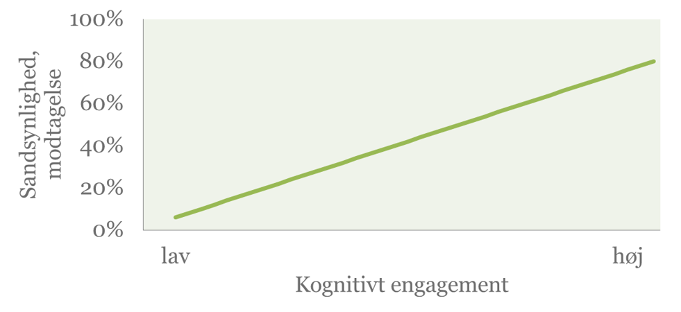
```
*Sandsynlighed for modtagelse afhængigt af politisk bevidsthed (kogn.engag.)*
]

---

# RAS 2/4: Modstand

.pull-left[
- Man modsætter sig argumenter, som er inkonsistente med ens grundholdninger

- Men **kun hvis man kan**! Hvis man besidder tilstrækkelig viden og kontekstuel information, der forbinder argumenter og grundholdninger

- = politisk bevidsthed gør det muligt at affeje information
]
--
.pull-right[
```{r, out.width="95%"}
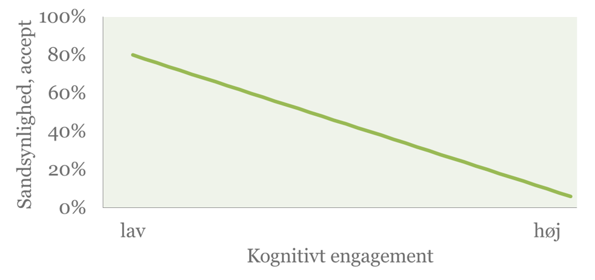
```
]
--
.pull-left[
**Modtagelse (A1) og modstand (A2) sammen**

- Tendens til at dem **midt på skalaen** for politisk bevidsthed er mest påvirkelige<br>(gælder dog ikke altid)
]
.pull-right[
```{r img2, out.width="60%"}
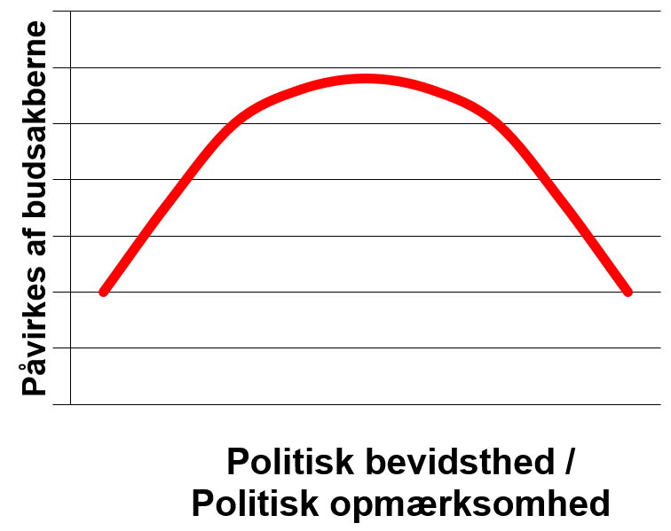
```
]

---

# RAS 3/4: Tilgængelighed

- __Overvejelser__ der har været *aktiveret* for nylig (hørt om, tænkt på) &rarr; findes hurtigere/nemmere frem ifm. holdningsdannelsen

- **Saliente/tilgængelige overvejelser** &rarr; alt man kan huske, der potentielt kan påvirke vurdering af politisk spørgsmål: argumenter, tanker, opfattelser, affekt
    - Tilgængeligheden varierer!

- Vigtig antagelse!

--

- Kan fx forklare **ustabilitet** i holdninger &rarr; skyldes forskellige tilgængelige overvejelser 

--

- Kan forklare **konkteksteffekter**  &rarr; kontekst aktiverer bestemte overvejelser
    - Må USA-journalister operere i USSR? Pressefrihed, demokrati, osv.
    - Må USSR-journalister operere i USA? Krig, spionage, osv.

---

# RAS 3/4: Sidenote om hukommelsen

.pull-left[
```{r mindmap, out.width="100%", fig.cap="(Guo & McCombs 2016)"}
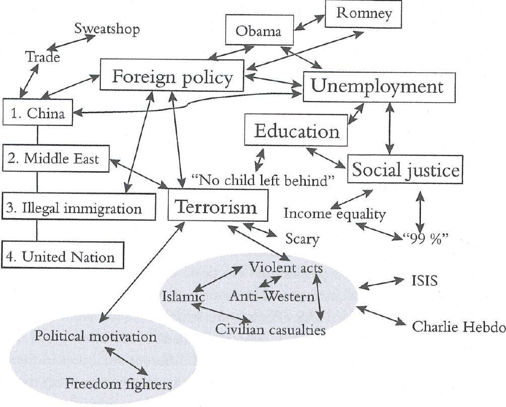
```
]
.pull-right[
- Vi gemmer ideer og overvejelser i vores hukommelse 

- &larr; langtidshukommelsen a.k.a. **associative memory**

- Priming og spreading-activation teori<br>(Collins & Loftus 1975)

- Plads til ca. 7 "overvejelser" i korttidshukommelsen (Miller 1956)

- Ofte "samples" (udtrækkes) blot 1-2 overvejelser. Ikke grund til mere. Livet er kort. 
]
---

# RAS 4/4: Svaret

- Hvad er en holdning så, John Zaller? 

- Eller rettere: hvad er (survey)**svaret**?

--

- **Vores holdning er gennemsnittet af de overvejelser, man har gjort sig i situationen** (vægtet efter hvor fremtrædende de er)

    - = et "holdningsudsagn"

--

- Zaller: Det kan vi godt kalde en politisk **"holdning"** (opinion, attitude), men den er altså konstrueret i den specifikke situation og vil derfor variere

--

    - I praksis antager vi, det er "sande holdninger", men er **bevidste om kontekstafhængigheden**, grundige med design, ydmyge med fortolkning, osv.

---

# Opsummering af RAS

En politisk **holdning** kan forklares i **tre trin**: 

- **(R)eceive:**

    - Du har modtaget (hørt og forstået) ny information eller argumenter

- **(A)ccept:**

    - Du har accepteret information eller argumenter, hvis de ikke var i klar modstrid med dine grundholdninger

- **(S)ample:**

    - Du sampler (udtrækker) mellem 0 og 7-ish (ofte 1-2) tilgængelige overvejelser/argumenter, som tilsammen (gennemsnit) giver dig dit svar &rarr; **Response**

---

# Implikationer af RAS-modellen

- **Problem**: Forskningen før Zaller indikerede meget ustabile holdninger

    - **Svar**: Varierende svar skyldes ikke, at man ændrer eller slet ikke har en holdning. Det skyldes, at man **aktiverer/sampler forskellige overvejelser**. 

--

- **Problem**: Den konkrete **formulering** af et holdningsspørgsmål kan give forskellige svar - hvorfor?

    - **Svar**: Forskellige overvejelser aktiveres gennem forskellige konnotationer. Konteksteffekter, framing osv. 
    
    - (Fluktuation kan også skyldes målefejl = uigennemtænkte, dårligt formulerede, for abstrakte spørgsmål)

--

- Holdninger er ikke konstante, men har dog rod i substans &rarr; vi *har* rent faktisk holdninger til politik

    - Desuden relativt **stabile grundholdninger**

---

# Nogle implikationer af RAS-modellen

## Bestemmes den offentlige mening af eliterne?

--

- **Ja!**

- Almindelige mennesker har ofte ingen førstehåndserfaring med politiske emner

- Selv ved "nære" emner definerer eliten forståelsesrammen

- Offentlige mening ofte et ekko af eliternes budskaber

- Også det **Tesler (2018)** viser på klimaområdet (men ikke evolution)

--

## Men!

- Grundholdninger kan ikke ændres af eliten (i hvert fald på kort sigt)

--

- Ofte **uenighed i eliten** (bredt begreb: politikere, journalister, aktivister, eksperter)

--

- Man kan afvise elitekommunikation, der strider mod grundholdninger

---

# Er Zallers RAS-model "sandheden"?

- Nej! Men det påstår Zaller heller ikke. 

--

- Det er først og fremmest en **teori**

    - en **parsimonisk model** med god forklaringskraft, quasiuniversel, integrerer de vigtigste, mest relevante indsigter

    - Forsimpler, udelader eller omfortolker eksisterende teori og viden, bl.a. fra (social)psykologien

---

# Kritik af Zaller

- Stærke antagelser! **Hvad siger I til den her?** 

> "[The RAS model] **makes no allowance for citizens to think, reason, or deliberate about politics**: If citizens are well informed, they __react mechanically__ to political ideas on the basis of external cues about their partisan implications, and if they are too poorly informed to be aware of these cues, they tend to __uncritically accept__ whatever ideas they encounter" (Zaller 1992: 45)

--

- Modellen har tendens til at blive urimeligt **mekanisk og deterministisk**

--

- Er antagelsen om **generel lav politisk bevidsthed** realistisk - også i Danmark? 

    - Danskerne ligger muligvis langt til højre på kurven for politisk bevidsthed

--

- Hvor kommer **grundholdninger** fra? Flytter han bare forklaringsproblemet?

--

- RAS lægger for meget vægt på **kognition**, hukommelse (frem for affekt, følelser, automatik)

--

- Forældet at **traditionelle massemedier** er vigtigste kilde til information?

---
class: title-slide, middle

# Nu har vi været igennem det vigtigste 

.pull-left[

Men vi mangler lidt...

1. Kort om Tesler (2018) og klimaholdninger i USA

2. Kort om "Klimavalget" og klimaholdninger i DK

3. Kort om *framing* og *dagsordenfastsættelse*

4. Afrunding

]

.pull-right[
```{r imggreta}
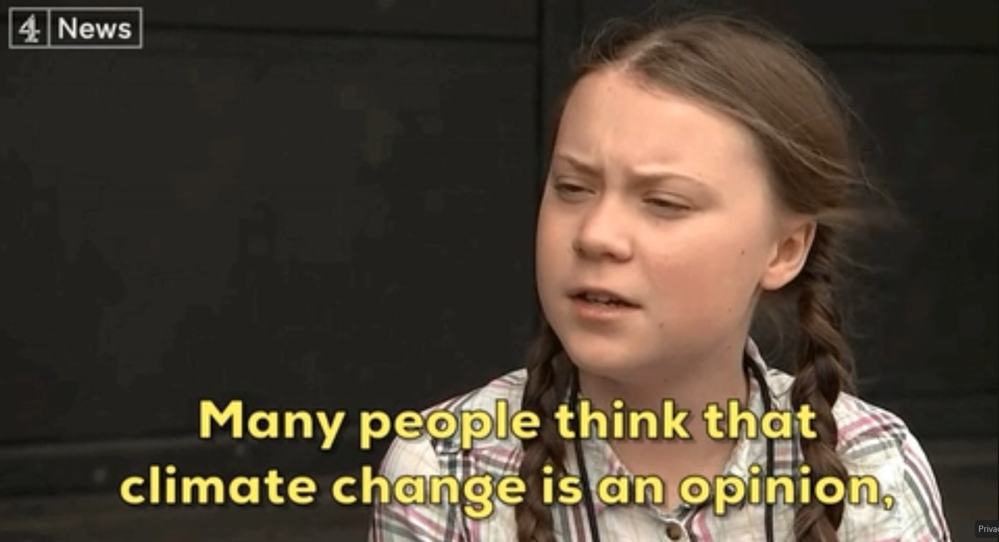
```
]
---

# Kort om Tesler (2018)

.pull-left[

**"Elite domination" af klimaholdninger i USA**

- Kreativ, nyere anvendelse af Zaller på klimaspørgsmålet i USA

- __Sammenligner klima med evolution pba. mange forskellige surveys__

- Operationaliserer **grundholdninger** med konservativ vs. liberal ideologi (*højre-venstre-skala*)

- Operationaliserer **politisk bevidsthed** med interesse (senere også uddannelse, opmærksomhed)
]

.pull-right[
<br>
```{r imgtesler1, out.width="75%"}
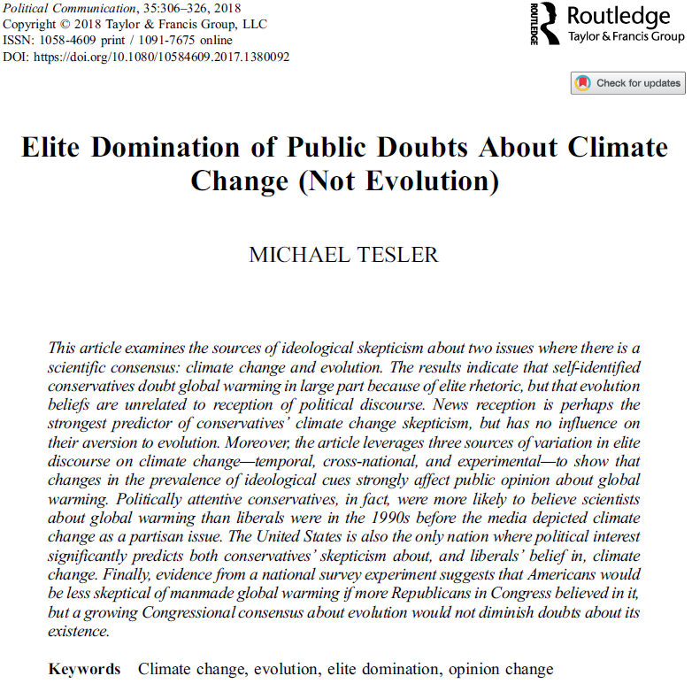
```
]

---

# Kort om Tesler (2018)

.pull-left[

**Puzzle:** 

- Store holdningsforskelle blandt de __politisk sofistiskerede__ trods tydelig videnskabelig konsensus 

- ingen "mainstream effekt"

- I stedet kraftig **polarisering**:
]

--

.pull-right[
```{r imgtesler2}
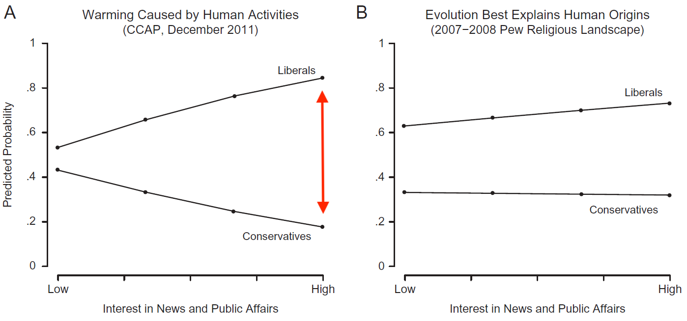
```
Teslers Figur 3: Klimaholdninger og politisk bevidsthed   

"*the __least knowledgeable__ liberals and conservatives had almost __identical__ global warming opinions*"

"*the __best-informed__ liberals and conservatives were __separated by a whopping 80% points__*" **WOW!!**

]

--

.center[__Forklaring: Modstridende eliteretorik (*information* &rarr; *reception*) plus *modstand*__]

---

# Kort om Tesler (2018)

.pull-left[
- __USA__ skiller sig ud!

- Stærk (negativ) sammenhæng mellem ideologi og klimaholdninger 

- Hvorfor?

```{r imgusa, out.width="70%"}
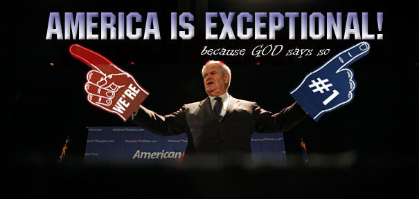
```
]

.pull-right[
```{r imgtesler3}
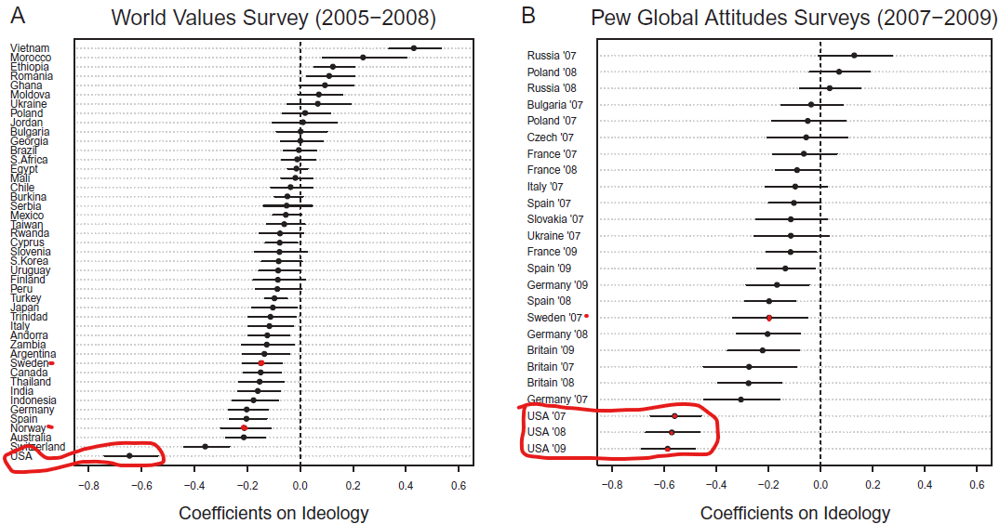
```
Teslers Figur 6: Sammenhæng mellem ideologi og klimaholdninger
]

--

- **Teslers forklaring: exceptionel elitediskurs om klima i medier mv. &rarr; politiseret, uvidenskabelig**

- USA eneste land, hvor politisk bevidsthed skaber accept (+) blandt liberale og skepsis (-) blandt konservative

<!-- .center[Mere Tesler (2018) i holdtimen] -->

---

# Kort om "Klimavalget" (Andersen & Hansen 2021)

.pull-left[

- *Danskernes klimaholdninger* 2019, historisk kontekst, betydning ved FV19

- Dertil holdningsdannelsesteori om værdi-/fordelingspolitik, **framing** og **dagsordenfastsættelse**  
]

.pull-right[
```{r imgklimavalget, out.width="40%"}
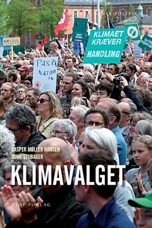
```
]

--

Modsat USA, hvor op til ~33% ikke tror på, at **mennesker påvirker klimaet**, mener kun **~6%** dette i DK (jf. https://www.sa.dk/en/the-danish-election-survey-1971-2019) 

I 2019 sagde op mod **60% (!!)**, at **klima er det vigtigste politiske spørgsmål** .. på tværs af befolkningsgrupper!

Men __masser af uenighed__ om prioritering, finansiering, løsninger (teknologi, livsstilændringer, afgifter)

---

# Kort om framing

--

- Information er aldrig blot en objektiv samling fakta

    - involverer uundgåeligt en bestemt framing, **en overbevisende historie**
    - Hvad sker/skete der, hvem bærer skylden og ansvaret?

--

- "Vinkling" af et problem eller emne (*"frames of reference"*)

--

> "[A] speaker **"frames"** an issue by encouraging readers or listeners to _emphasize certain **considerations**_ above others when evaluating that issue" 

> "A **framing "effect”** occurs when individuals arrive at different positions on the issue, depending on the priority given to various considerations" (Chong & Druckman 2007) 

- "one of the most stunning and influential demonstrations of *irrationality*" (Druckman 2004) 

--

- Framingstudier er meget udbredte - også blandt stud.scient.pol.'er (fx Slothuus 2010)

---

# Eksempel fra "Klimavalget"

.pull-left[
```{r imgframing}
include_graphics("media/framing.png")
```
(Hansen & Andersen 2021: 215)
]

.pull-right[
- Fire forskellige "frames" 

- Spørgsmål: "Klimaforandringerne er vor tids største udfordring"

- En frame påvirker svaret: "FN's klimapanel ...", så 75 % i stedet for kontrolgruppens 70 % er enige

- Hvorfor? Tillid til FN eller videnskaben? Håb? Eksisterende holdning?
]

---

# Kort om dagsordenfastsættelse

--

.pull-left[

- a.k.a. **agenda-setting**

- Politiske emner (*issues*) &rarr; høj/lav saliens &rarr; rangering på politisk dagsorden

- Dagsordenfastsættelse: at påvirke emners relative saliens og dermed dagsordenen

- Den opfattede vigtighed ("saliens") af klima steg på fem måneder **fra 20 til 60 procent**

- **Forklaringer i "Klimavalget":** ekspertrapporter, aktivisme (Thunberg, #FridaysForFuture, demonstrationer), interesseorganisationer, øko-køer på græs (&#x263A;), **mediedækningen**
]

.pull-right[
```{r imgclimagenda}
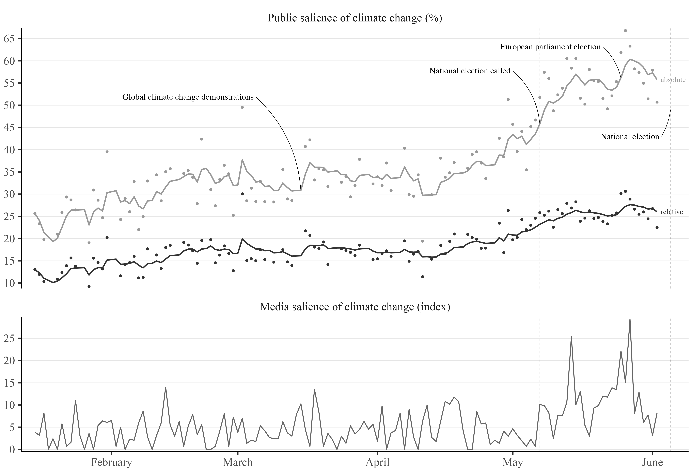
```
Klimaets saliens i DK, 2019<br>(Damsbo-Svendsen 2022)

]

---

# Kort om dagsordenfastsættelse

.pull-left[

Min egen forskning:

- **Omfanget af mediedækningen af klima** (målt i klimaartikler på *dr.dk/nyheder*) **var med til at drive den eksplosive stigning** i klimabekymring/-opmærksomhed

- Det gælder især blandt grupper, som i forvejen går op i klima: unge, venstreorienterede, kvinder, byboere

- Forklaringen (=medier) passer ret godt til Zallers RAS-model?

- Mere om dette om et par uger (#6 Medier)

]

.pull-right[
```{r imgclimagenda2}

```
Klimaets saliens i DK, 2019<br>(Damsbo-Svendsen 2022)

]

---

# Opsummering

- Hvad er en holdning? 

- Forkert spørgsmål. Tænk i stedet, hvad er **holdningsdannelsesprocessen**: hvad er de vigtigste **variable**, hvad er **konteksten**, og hvordan former det et observerbart **holdningsudsagn**?

--

```{r, out.width="60%"}

```

---

# Opsummering

- Hvad er en holdning? 

- Forkert spørgsmål. Tænk i stedet, hvad er **holdningsdannelsesprocessen**: hvad er de vigtigste **variable**, hvad er **konteksten**, og hvordan former det et observerbart **holdningsudsagn**?

- **Information** (eliter, medier, omgivelser) og **individuelle prædispositioner** interagerer og former de overvejelser, der anvendes til at konstruere en holdning i situationen

--

- RAS-modellen:

    - **Receive (modtagelse)** - du har hørt og forstået information og argumenter
    - **Accept (modstand)** - du har accepteret det, der ikke var i klar modstrid med dine grundholdninger
    - **Sample (tilgængelighed og svar)** - du udtrækker nogle overvejelser i situationen og svarer ud fra gennemsnittet
    
---

# Næste gang

<br>

- Zallers RAS-model er ikke den eneste indflydelsesrige teori om holdningsdannelse

- Næste uge en anden kanonisk holdningsdannelsesteori fra politisk psykologi: 

    - **Motivated reasoning**

- Derudover lidt om **heuristikker**

<br><br>

# Spørgsmål?

---
class: title-slide, center, middle

# Tak for i dag! 

<br><br>

***

### Mere om klimaholdninger til de nysgerrige:

Valgundersøgelsen (DK): https://www.valgprojektet.dk/pages/page.asp?pid=308&l=dk

CONCITOs klimabarometer (DK): https://concito.dk/emne/klimabarometeret

Yale Climate Opinion Maps 2021 (USA): https://climatecommunication.yale.edu/visualizations-data/ycom-us/
