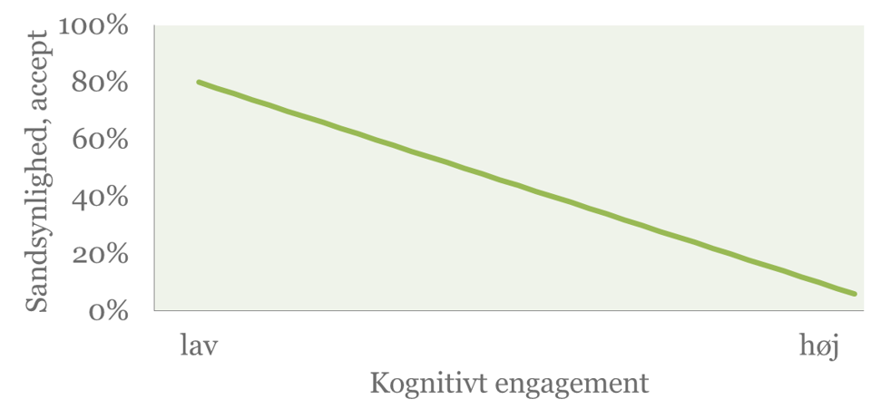
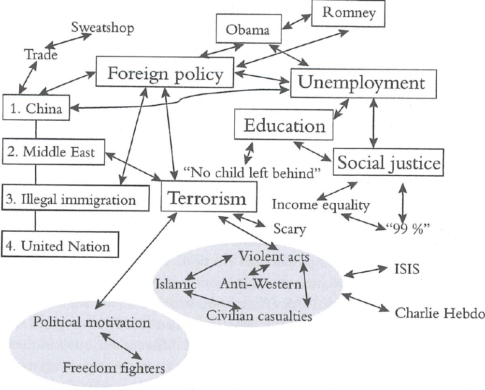
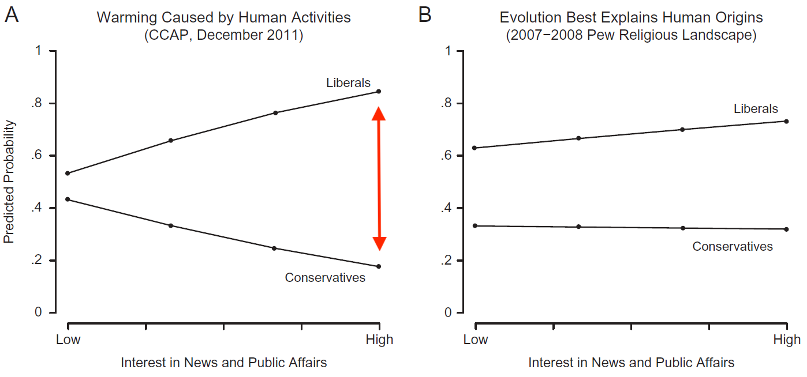

```{r, include = FALSE}
pacman::p_load(tidyverse, 
               knitr, 
               lubridate, 
               kableExtra,
               xaringan,
               xaringanExtra)

knitr::opts_chunk$set(echo = FALSE, 
                      fig.align = "center", 
                      cache = TRUE,
                      out.width="1000px"
                      )

Sys.setlocale(locale = "da_DK.UTF-8")

xaringanExtra::use_tile_view()

```

<!--- NOTER

- Klimaeksempler (evt. klimagrafer)
- Tegninger
- Øvelse(r): Tænk over en holdning, du føler stærkt for, og hvordan/hvilken information den afhænger af, omvendt tænk på en der er uafhængig af information i snæver forstand, tænk over om det er en realistisk antagelse…
- Opdel i 4-6 blokke
- Billeder! Grafer! memes! 
- Nævn min egen forskning? 
- Nævn måling af holdninger med surveys ??

Sidste noter til Zaller:

- En generel teori (på tværs af issues)
- Side 1: Ideer. Folk varierer i deres opmærksomhed og eksponering. Folk kan kun reagere kritisk på information, hvis de har viden. Folk har ikke faste holdninger til alting, men konstruerer "holdningsudsagn". Folk bruger primært de ideer, der mest tilgængelige. 
- Vigtigste variable: Politisk awareness og political values
- Svaghed (styrke?): Prædispositioner (værdier, grundholdninger, ideologi mv. "values and other predisposition") er - med vilje - meget bredt og åbent formuleret... Op til andre at opklare og uddybe, hvad der er de vigtigste "moderatorer". 
- I høj grad baseret på politisk psykologi, men vinklet på politologi (ikke nødvendigvis overbevisende eller fagsprog for psykologer)
- Massekommunikation

- Øvelse: Snak om en holdning, der er vigtig for en af jer. Hvilken information/kommunikation/elitediskurs er den blevet influeret af?
- Øvelse: Mikropause. Gå ind på en nyhedsapp eller website og læs den øverste nyhed og tænk over, om der er noget relevant information til jeres holdning til emnet. Mærk efter, hvordan det spiller sammen med jeres grundholdninger, om I er tilbøjelige til at acceptere det eller ej.


SLIDES START --->

# Quick attention capturing opening (controversy or puzzle)

Hvad er det, vi gerne vil forstå og forklare?

- Hvad vil vi forstå: din skøre onkel, os selv, modparten, den offentlige mening (politik)

--

- Hvorfor er der så mange vaccinemodstandere?

--

- Hvorfor er der nogen, der mener at klimaforandringer kan klares med ny teknologi, mens andre er dybt uenige?

--

- Hvorfor er der uenighed om, hvorvidt en høj, generel CO2-afgift er en god idé?

--

--

- Hvorfor mener folk, at liberal immigrationspolitik er en kulturel trussel, en adgang til værdifulde ressourcer eller en god, humanistisk gerning?   

- Hvorfor er der endda nogen (i DK omkring 6%, i USA mange! ~32%), der ikke tror på menneskeskabte klimaforandringer? Tjek klimaholdninger i USA [her](https://climatecommunication.yale.edu/visualizations-data/ycom-us/).

```{r imgpublic}
include_graphics("media/po.png")
```

---

# State the key point or thesis

- Løsning: Marriage af information (omgivelser, især elite) og predispositioner (individ) plus kontekst 

---

# Pege tilbage

- Mikro/makro

- Skillelinjer (på systemniveau)

- Vi bevæger os langt ned på mikroniveauet, men ikke kun for at blive dér - også for at forklare og forstå "public opinion" som institution eller vigtig drivkraft i politik. 

- Politisk **adfærd**, institutioner

"a public opinion that is truly public — a public opinion that extends beyond the confines of individual calculation and cohesive social groups" (Carmines & Huckfeldt, 1998)

---

# Ugens tekster

Hvad, hvorfor?

- Zaller (1992) [30 år/billede/citater]

- Tesler (2018) - fantastisk test med Zaller-framework

- Andersen & Hansen (2021) - kontekst og yderligere begreber

*Mange* sider i denne uge. Fortvivl ikke, hvis I ikke har nået det eller når det helt. Men forsøg at indhente til næste uge.   

---

# Hvorfor er det vigtigt at studere holdningsdannelse?

- Public opinion, democracy

- Min egen personlige interesse: Det er statskundskab! Virkede ekstremt vigtigt på mig. 

Centralt for nogle af de helt grundlæggende diskussioner inden for statskundskab:

Demokrati er en metode til at samle ”folkets” politiske holdninger i et ”styre”.

Berelson (1952): Demokratisk sundhedstjek
”The teorist tell us how a democratic electorate is supposed to behave and we public opinion researchers claim to know something about how the democratic electorate in this country actually behave.” 
Tilfredshed med livet, demokrati, politikerne el. de politiske institutioner
Forståelse for hvad skaber og ændrer holdninger
Flere meningsmålinger end nogensinde før

---

# State objective and roadmap

- To do:
- Fokus på Zaller - den er vigtig og den er god og den giver en rigtig god måde at tænke på holdningsdannelse - og en måde man kan huske!

- Klimaeksempler pga. egen forskning og fordi jeg håber I også synes det er interessant og aktuelt

---

# Hvad er en holdning og den offentlige mening (public opinion)?

## Den naive version

.pull-left[
Meningsmålinger som objektiv "temperaturmåling":

1. Person A har en holdning
2. Person A ringes op af Gallup
3. Gallup stiller spørgsmål til holdning
4. Person tænker sig om og informerer Gallup om sin holdning
5. Gallup opsummerer holdningerne for alle personer
]

.pull-right[
```{r imgtermo}
include_graphics("media/termometer.jpg")
```


]

Meningsmålinger: Formidling af den offentlige mening

---

# Hvad er en holdning og den offentlige mening (public opinion)?

- Ikke en enkelt soleklar klar definition på en holdning ...

- Druckman & McGrath (s. 111): "*__a standing (or prior) belief__. This belief can be any climate change-relevant construct, such as beliefs that climate change is occurring, that climate change is anthropogenic, about a scientific consensus on climate change, about a conspiracy with regard to climate change, about who is responsible for causing and/or addressing climate change, about the efficacy of mitigation policies, about risks from climate change, about the impact of climate-relevant behaviours (such as biking instead of driving) and about the importance of climate change as a national or global issue*"  
  
- "*it is perfectly reasonable to give heavy weight to one’s own carefully constructed attitudes. This perspective [...] suggests that beliefs and attitudes may be thought of metaphorically as possessions to be protected*" (Taber & Lodge, 2006, s. 767)

- Forskellige begreber: Attitude, opinion, preference, belief, affect, perception, position, indstilling, holdning, mening, præference, opfattelse, viden, følelse, etc. 

- Typisk til et issue (fx klima eller uddannelse) eller bredere (grundværdier, ideologi etc.)

- Nært relateret til politisk adfærd

- Ikke så afgørende - og god grund til, at der ikke er en endegyldig definition:

- Ikke-holdninger (non-attitudes) er udbredte har vi vidst siden Converse et al. (1964) "The American Voter" ... Til nogle issues! 

Zaller spørger på side 28 "What is an opinion" og vi venter spændte på en klar definition... Men han holder os hen med lange overvejelser omkring problemet med en "holdning", men endelig på side 35 når han frem til følgende:  

> I abandon the conventional but implausible view that citizens typically possess "true attitudes" on every issue about which a pollster may happen to inquire, and instead propose a model of how individuals construct opinion reports in response to the particular stimuli that confront them.

Ikke en substantiel entity. Det er udgangspunktet for RAS-modellen. Vi skal bruge en model snarere for survey-svar end holdninger. Processuel. 

???

Problemer: Non-attitudes, ustabilitet, ikke-krystalliseret, effekter af spørgsmålformulering (og framing) mv.

---

Den offentlige mening

those opinions held by private persons which governments find it prudent to heed (Key 1961:14)

the combined personal opinions of adults towards issues of relevance to government (Erikson et al. 1991:13)

an implicit verbal response or ‘answer’ that an individual gives in response to a particular stimulus situation in which some general ‘question’ is raised (Lane & Sears 1964:6)

the complex of beliefs expressed by a significant number of persons on an issue of public important (Hennessy 1967:97-98)

expressions of attitudes about government and politics (Cummings & Wise 2001:170)

Borgernes udtrykte og aggregerede holdninger til politiske spørgsmål 
(eget bud)


---
class: title-slide, center, middle

# Zaller's RAS-model

.pull-left[

30 års jubilæum, udkom i 1992 og er citeret mere end 14.000 gange

Meninger er multidimensionale
Hvad der svares i meningsmålinger er et udtryk for det mest fremtrædende på det tidspunkt

Zallers teori om meningsdannelse 
Formål er en generelt og universel teori for meningsdannelse

Samfundsmæssige karakteristika (makro)
Opinionslederne, Mediedækningen
Individuel karakteristika (mikro)
Grundholdning, Opmærksomhed


]

.pull-right[
```{r zallerimg, out.width="50%"}
include_graphics("media/John-Zaller.jpg")
```

```{r zallerbook, out.width="50%"}
include_graphics("media/zallerbook.jpg")
```

]

---

# Tegninger

```{r zallerlogic}
include_graphics("media/tegning.jpg")
```

---

# Baggrund for Zaller: Converse (1964)

”Large portions of an electorate simply do not have meaningful beliefs” (Converse 1964)

Endnu mere klassisk end Zaller (1992), men på nogle punkter også lidt forældet/forkert

Converse registrerede, at folk ændrede holdninger, de havde modstridende holdninger og de havde meget begrænset viden

Konklusion: Folk har ikke egentlige politiske holdninger, og de svarer tilfældigt (gætter) på de spørgsmål de stilles

- De er "rationally ignorant" (Downs 1957) men med stor variation

---

Eksempel : 
En tredjedel af respondenterne i en amerikansk survey havde en holdning til The Public Affair Act of 1975
Problemet: The  Public Affair Act of 1975 har aldrig eksisteret
	Kilde: Bishop et al. (1986)

Danmark
36% har en holdning til Nytårspakken (n=2021, jan. 2005)
7% har en holdning til Lovforslag 712 (n=2021 , jan. 2005) 

Pseudo- holdninger / non-attitudes

Social desirability
Respondent svarer som der forventes

---

# Zaller's nøglebegreber

- Information, elite-diskurs, messages
- "Considerations"
- Politisk bevidsthed, viden, generel, cognitive engagement (with an issue vs. general) ...
- Politiske prædispositioner, ideologi, værdier (andet) 
  - Cueing messages
  
- "Attentiveness to elite political discourse" = political awareness
  
  
Eliternes (mediernes, politikernes, eksperternes) budskaber

Hvem er eliten? Politikere, embedsmænd, journalister, aktivister, eksperter 

Hvad det bliver sagt i nyhedsstrømmen

Politisk opmærksomhed
Faktuel politisk viden
Hvor ofte man læser avis
Ser nyheder på TV
Politiske interesse

Grundholdning
Ideologi, værdier

=> Holdning (svaret) = Blanding af politisk opmærksomhed, grundholdning og eliternes påvirkninger

---

# Information og elitediskurs

- Eller kommunikation

- Aggregeret, ofte af institutionel karakter (fx massemedierne)

- Kan også komme fra direkte samtaler med familie, venner, naboer, kollegaer (men antages implicit at være sjældent og/eller mindre vigtigt)

---

# Politisk bevidsthed

Synonymer og forskellige måder at måle det ...

Ene ekstrem: Twittersegmentet, dem der kan navnene på alle regeringens ministre, får push-notifikationer fra diverse nyhedsapps, snakker om politik med andre osv.

Anden ekstrem: Dem der ikke aner, hvor mange der sidder i folketinget eller hvilken kommune, de selv bor i, kun hører de største mest personligt relevante nyheder (måske fra andre), ikke interesserer sig og følger med

> "(1) people vary greatly in their general attentiveness to politics, regardless of particular issues; and (2) that average **overall levels of information are quite low**"

Zaller side 21: opmærksomhed på politik (nyheder osv.) *og* forståelse af politisk information. Absorbering! Kognitivt engagement! Modtagelse/eksponering *og* forståelse! 

Måling! Bedste: neutral faktuel politisk viden (mest objektiv). I praksis bruges (selvrapporteret) politisk interesse, medieforbrug og uddannelse ofte som proxier. 

"Kognitivt engagement med et politisk emne"

???

Zaller (1992: 21): Politisk bevidsthed er en af flere mulige labels, fx ekspertise, kompleksitet, involvering, opmærksomhed, sofistikation, skarphed.  

---

# Politiske prædispositioner

- Tilbøjelighed til at acceptere ny information ... Styret af forskellige individuelle faktorer: interesser, værdier, erfaringer, ideologi etc.  

- Relativt stabile

- Regulerer optagelsen af information i holdningsdannelse ...

- Påvirkes ikke på kort sigt af information eller af eliten 

- Kan komme af mange ting, livserfaringer og oplevelser af politisk karakter, socialisering i barndom og ungdom, social status, genetik, partitilhørsforhold

- To prædispositioner fylder meget: politiske værdier (ofte kaldet **grundholdninger**) og ideologi (ofte højre-venstre-placering, liberal/konservativ, rød/blå)

???

Værdier: Økonomisk individualisme (kollektivisme), humanisme, environmentalism

---

# Receive-Accept-Sample (RAS)

RAS-modellen for holdningsdannelse er baseret på - eller måske endda defineret ved - følgende **fire antagelser**:

1. Modtagelsesantagelsen (*Reception*) - **R** 

2. Modstandsantagelsen (*Resistance*) - **A**

3. Tilgængelighedsantagelsen (*Availability*) - **S**  

4. Svarantagelsen (*Response*) - **S**

(... okay, den burde måske have heddet RASS eller RRAR (MMTS)?)


---

# RAS 1/4: Modtagelse

Jo mere man tænker og beskæftiger sig med et emne => Jo mere viden har man om det emne => jo højere er chancen for at man er opmærksom på,  bliver udsat for og forstår de politiske budskaber i nyhedsstrømmen.

...

Politisk bevidsthed/opmærksomhed... (for emnet)

Interesse, viden, medieforbrug.  

```{r img1}
include_graphics("media/Picture1.png")
```

---

# RAS 2/4: Modstand

Man modsætter sig argumenter, som er inkonsistent med ens grundholdninger, men kun hvis man besidder tilstrækkelig information, så man kan relateres grundholdningerne til argumenterne

```{r img2}

```

--

Plus: Cueing messages dvs. kontekstuel information, der tillader at sætte informationen i relation til grundholdninger 

---

# Modtagelse-Modstand kombineret 

Plot Zaller Figure 2.3 side 20.

Ikke lineært!

Ikke altid bueform, bare en teoretisk generalisering. Også eksempler, hvor det er de mest eller mindst politisk bevidste, der er mest påvirkelige.  

---

# RAS 3/4: Tilgængelighed

Meninger, som for nylig har været aktive => jo hurtigere og nemmere vil man finde at bruge dem i meningsdannelsen

Denne antagelse kan blandt andet forklare konkteksteffekten
Når man spørger om amerikanske journalister i Rusland, aktiveres overvejelser om pressefrihed etc.
Når man derefter spørges om sovjetiske journalister i USA, hentes overvejelser om pressefrihed frem igen	
Folk vil gerne fremstå konsistente og rækkefølgen aktiverer forskellige overvejelser. 

- Lynhurtig process - ofte 1-2 overvejelser bag... Tager sig generelt ikke tid. Ingen grund til det. Livet er kort. 

- "Considerations": Enhver ting, der potentielt kan påvirke vurdering af et politisk spørgsmål. Både kognitivt (bevidste tanker) og affektivt (følelser, mavefornemmelser). 

- Saliens, top of the head

- **BUCKET ANALOGY**

---

# RAS 3/4: Tilgængelighed

Sidenote om hjernen og hukommelsen:

```{r mindmap}

```

Spreading-Activation Theory

Syv ting i korttidshukommelsen (Miller, 1956)?

???

Miller, G. “Human Memory and the Storage of Information.” IEEE Transactions on Information Theory 2, no. 3 (September 1956)

Loftus, Elizabeth F. “A Spreading-Activation Model of Semantic Processing.” In A History of Psychology in Autobiography, Vol. IX., edited by Gardner Lindzey and William M. Runyan, 199–227. Washington: American Psychological Association, 1975. 


---

# RAS 4/4: Svaret - "holdningen"

- Hvad er holdningen så? Hvad er (survey)svaret?

- Ens (rapporterede) holdning er gennemsnittet af de (tilgængelige) overvejelser, man har gjort sig i situationen (vægtet efter hvor fremtrædende de er)

- Ifølge Zaller: Det kan vi godt kalde en "holdning" (attitude, opinion) for den givne situation

- Men det er ikke en ægte/sand holdning

- "Holdningsudsagn"

- Min kommentarer: Vi opererer ofte med det som om det er "ægte holdninger", men med bevidsthed om stærk situations- og kontekstafhængighed og med ekstremt grundig tilgang til design af spørgsmål mv.

---

# Opsummering af RAS

En politisk **holdning** (svaret på et holdningsspørgsmål i en given situation) kan forklares med tre led: 

- (1) **R**eceive:

Du har modtaget (hørt og forstået) en række argumenter

- (2) **A**ccept:

Du har accepteret argumenter, hvis de ikke har været i klar modstrid med dine grundværdier

- (3) **S**ample:

Du sampler (udtrækker eller hiver frem) mellem 0 og N overvejelser/argumenter, som tilsammen (i gennemsnit) giver dit svar.

---

# Nogle implikationer af RAS-modellen

Problem: Forskningen før Zaller indikerede meget ustabile holdninger

Svar: Varierende svar skyldes ikke at man ændrer grundholdninger. De skyldes, at man aktiverer andre overvejelser. 

Problem: Den konkrete formulering af et holdningsspørgsmål kan give forskellige svar

Svar: Igen skyldes det, at forskellige overvejelser aktiveres gennem forskellige konnotationer etc. Spørgsmålsformuleringer og konteksteffekter. Evt. **eksempler**.


- Konsekvens af Zaller ift. holdningsstabilitet: Kan variere hvilke considerations, der er accessible eller bliver aktiveret. Kan forklare "ustabilitet".   


---

# Nogle implikationer af RAS-modellen

```{r}
include_graphics("media/bevidsthed-paavirkning.png")
```

Personer med moderat politisk interesse kan ofte være de mest påvirkelige

Den offentlige mening er et ekko af eliternes budskaber (**Tesler, 2018!**)

---

# Bestemmer eliterne den offentlige mening ifølge RAS?

Ja! => ifølge Zaller 
Almindelige mennesker har sjældent selv førstehåndserfaringer i politiske spørgsmål
Selv ved ”nære” emner bestemmer eliten, hvordan vi tolker (framer) disse emner 

- Også det Tesler (2018) viser på klimaområdet ("elite domination")

Men: 
Grundholdninger kan ikke ændres af eliterne (på kort sigt)
Eliten er et bredt begreb: 
Politikere, højtstående embedsmænd, journalister, nogle aktivister og mange eksperter og specialister
Der er ofte uenighed i eliten
Og dermed udsættes folk for forskellige argumenter, og har dermed tendens til at modtage og anvende de argumenter, der er i overensstemmelse med deres grundholdninger

---

De spørgsmål Converse (og andre) stiller er dårligt formulerede og meget abstrakte

Personer har stabile grundholdninger og fluktuationer i personers svar skal primært betragtes som måleproblemer


---

# Er Zallers RAS-model "sandheden"?

- Nej. Men det påstår han heller ikke. 

- Parsimonisk model. Med god forklaringskraft og integration af vigtig teori! Mange psykologisk viden - også i 1992 - som ignoreres eller forsimples

- Kritik: Modellen har tendens til at blive mekanisk og deterministisk

- Er Zallers antagelser om lav politisk bevidsthed realistiske - også i Danmark? 

Danskerne følger mere med i politik og ligger derfor muligvis langt til højre på Zallers kurver for politisk bevidsthed!

---

# Er Zallers RAS-model "sandheden"?

Og hvad med den her? 

> "This postulate [RAS A1-A2] **makes no allowance for citizens to think, reason, or deliberate about politics**: If citizens are well informed, they react mechanically to political ideas on the basis of external cues about their partisan implications, and if they are too poorly informed to be aware of these cues, they tend to uncritically accept whatever ideas they encounter" (Zaller 1992: 45)

Kan I acceptere en antagelse om, at borgerne i det store hele ikke kan tænke eller diskutere sig frem til holdninger (uafhængigt af elite-diskurser mv.)?

---

# Andre svagheder/mangler hos Zaller

- Kognitiv vs. affektiv. Uenighed om hvad der er mest væsentligt.   

- Individer universel vs. individer forskellige (konservative vs. liberale; Alford et al., Haidt et al.)

- Hvor kommer så grundholdninger fra? Flytter bare forklaringsproblemet? ("Beyond the scope")

... Ikke den eneste teori om holdningsdannelse ... næste uge lidt mere og lidt overblik ...

- "Information" - for snævert eller for bredt begreb? "attempts to capture what is most important about what is happening in the world" (inkl. framing) ... "persuasive messages" ...

---
class: title-slide, middle
layout: true

Vi har været igennem det vigtigste (Zaller)! Men der er mere: 

.pull-left[

1. Kort om Tesler (2018) og klimaholdninger i USA

2. Kort om "Klimavalget" og klimaholdninger i DK

3. Kort om *framing* og *dagsordenfastsættelse*

4. Afrunding

(Sandynligt at vi ikke det hele...) 
]

---

.pull-right[
<div style="width:100%;height:0;padding-bottom:55%;position:relative;"><iframe src="https://giphy.com/embed/KCqmVVTQRsMSliDbtt" width="100%" height="100%" style="position:absolute" frameBorder="0" class="giphy-embed" allowFullScreen></iframe></div>
]

---

.pull-right[
<div style="width:100%;height:0;padding-bottom:50%;position:relative;">
```{r imggreta, out.width="498px", fig.pos="H!"}
include_graphics("media/greta.png")
```
</div>
]

---
layout: false

# Kort om Tesler (2018)

.pull-left[

**"Elite domination" af klimaholdninger i USA**

- Kreativ og overbevisende nyere "test" af Zaller - på klimaområdet i USA

- Bruger mange forskellige surveys og sammenligner klima med evolution

- Operationaliserer grundholdninger med konservativ vs. liberal ideologi (højre-venstre)

- Operationaliserer politisk bevidsthed med interesse, uddannelse, opmærksomhed
]

.pull-right[
</br>
```{r imgtesler1, out.width="60%"}
include_graphics("media/tesler1.png")
```
]

---

# Kort om Tesler (2018)

.pull-left[

- Ironisk og puzzling: Store holdningsforskelle blandt de mest politisk sofistiskerede trods videnskabelig konsensus (ingen "mainstream effekt").

- = Polarisering!

- **Wow!** (s. 317): 
    - "*the least knowledgeable liberals and conservatives had almost __identical__ global warming opinions*"
    - "*the best-informed __liberals and conservatives were separated by a whopping 80% points__*"

- Forklaring: Elite-retorik (information)
]

--

.pull-right[
```{r imgtesler2}

```
Teslers Figur 3: Klimaholdninger for forskellige niveauer af politisk bevidsthed
]

---

# Kort om Tesler (2018)

.pull-left[
- __USA__ skiller sig ud!

- Stærk (negativ) sammenhæng mellem ideologi og klimaholdninger 

- Hvorfor?

```{r imgusa, out.width="70%"}
include_graphics("media/american.jpg")
```
]

.pull-right[
```{r imgtesler3}
include_graphics("media/tesler3.png")
```
Teslers Figur 6: Sammenhæng mellem ideologi (højre-venstre-skala) og klimaholdninger
]

--

**Forklaring: En anderledes elite-diskurs om klima - især i medierne. Mere politiseret og mindre videnskabelig.**

--

Meget mere at komme efter i Tesler (2018) &rarr; holdtimen

---

# Kort om "Klimavalget" (Andersen & Hansen 2021)

.pull-left[

- God introduktion til *danskernes* klimaholdninger anno 2019, historisk kontekst og betydning ifm. 2019-valget 

- Berører desuden på en meget let måde holdningsdannelsesteorier og -begreber som **værdi-/fordelingspolitik**, **framing** og **dagsordenfastsættelse**  
]

.pull-right[
```{r imgklimavalget, out.width="40%"}
include_graphics("media/klimavalget.jpg")
```
]

Modsat USA er der kun ca. **6%** i DK, der ikke tror på, at **mennesker påvirker klimaet** (jf. data som findes her: https://www.sa.dk/en/the-danish-election-survey-1971-2019) og op mod 60% (!!) siger, at **klima er det vigtigste politiske spørgsmål** (på tværs af befolkningsgrupper!)

Men masser af uenighed om prioritering, finansiering, løsninger (teknologi, livsstilændringer, skat), osv.

---

# Framing

--

- *Frames of reference*: "Vinkling" af et problem eller emne

> "[A] speaker **"frames"** an issue by encouraging readers or listeners to emphasize certain considerations above others when evaluating that issue" 

> "A **framing "effect”** occurs when individuals arrive at different positions on the issue, depending on the priority given to various considerations" (Chong & Druckman 2007) 

--

- Klar relation til Zaller, information, aktivering af forskellige overvejelser, etc.

--

- Information er aldrig bare objektive fakta, men involverer næsten uundgåeligt en bestemt framing

--

- Framingstudier er meget udbredte - også blandt stud.scient.pol.'er (fx i metodeopgaver og BA-projekt)

---

# Framing: Kort eksempel fra "Klimavalget"

.pull-left[
```{r imgframing}
include_graphics("media/framing.png")
```
Figur 9.1 i Hansen & Andersen (2021: 215)
]

.pull-right[
- Fire forskellige "frames" 

- Spørgsmål: "Klimaforandringerne er vor tids største udfordring"

- En enkelt frame påvirker svaret: "FN's klimapanel ...", så 75 % i stedet for 70 % (kontrolgruppen) er enige

- Hvorfor? Tillid til institution (FN)? Videnskab? Håb? 

- Mange gode framing-studier (se fx Slothuus, 2010), men ofte meget kontekstafhængige
]

---

# Dagsordenfastsættelse

--

.pull-left[

- Den opfattede vigtighed ("saliens") af klima steg på fem måneder i 2019 **fra 20 til 60 procent**

- **Forklaringer i "Klimavalget":** Ekspertrapporter, aktivisme (Thunberg, #FridaysForFuture, demonstrationer), interesseorganisationer, øko-køer på græs (&#x263A;), **mediedækningen**

- Medieforklaringen passer da ret godt til Zaller og RAS-modellen?

- Politiske emner (issues) &rarr; saliens &rarr; politisk dagsorden (agenda) &rarr; dagsordenfastsættelse

]

--

.pull-right[
```{r imgclimagenda}
include_graphics("media/figure1_climate-agendas_new.png")
```
Klima i Danmark, 2019: Saliens og mediedækning

]

---

# Dagsordenfastsættelse

.pull-left[

Ifølge min egen forskning (pt. i peer-review): 

- **Omfanget af mediedækningen af klima** (målt i artikler på *dr.dk/nyheder*) **var med til at drive den eksplosive stigning** i klimabekymring/-opmærksomhed

- Det gælder især for dem, der i forvejen går op i/følger med i klima: Unge, venstreorienterede, kvinder, byboere

]

.pull-right[
```{r imgclimagenda2}
include_graphics("media/figure1_climate-agendas_new.png")
```
Klima i Danmark, 2019: Saliens og mediedækning

]

--- 

# Opsummering

Hvad er en holdning og konsekvenserne ved definitionerne?

RAS-modellen antagelser
Receive - Du har modtaget (hørt og forstået) en række argumenter
Accept - Du har accepteret argumenter, hvis de ikke har været åbenlyst i modstrid med dine grundværdier
Sample - Du ”udtrækker” (sampler) nogle argumenter/ overvejelser, og gennemsnittet af disse afgør dit svar

Det man skal huske: Information og individuelle prædispositioner (min tegning!) former "holdninger" (holdningsudsagn). Og at der er mange nuancer i RAS-modellen, som man kan vende tilbage til


---

# Pege fremad

- En anden kanonisk holdningsdannelsesteori fra psykologi: "Motivated reasoning" 

- Heuristikker

- Relaterede og vigtige teorier om holdningsdannelse

- (affect, biology, ideology, etc.)

---

Mere om klimaholdninger i Danmark: Fx Valgundersøgelsen (https://www.valgprojektet.dk/pages/page.asp?pid=308&l=dk) eller CONCITOs Klimabarometer (https://concito.dk/emne/klimabarometeret)

Mere om klimaholdninger i USA: Yale Climate Opinion Maps 2020 (https://climatecommunication.yale.edu/visualizations-data/ycom-us/)

