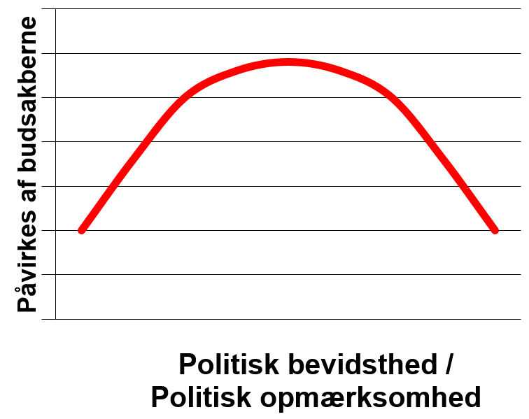
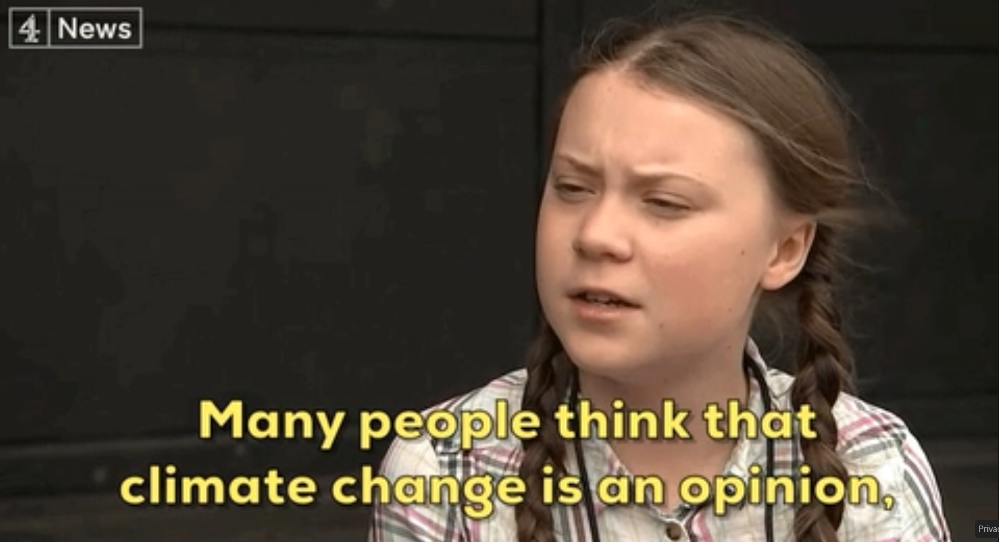
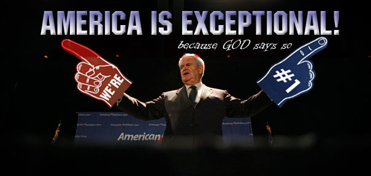

```{r, include = FALSE}
pacman::p_load(tidyverse, 
               knitr, 
               lubridate, 
               kableExtra,
               xaringan,
               xaringanExtra)

knitr::opts_chunk$set(echo = FALSE, 
                      fig.align = "center", 
                      cache = TRUE,
                      out.width="1000px"
)

Sys.setlocale(locale = "da_DK.UTF-8")

xaringanExtra::use_tile_view()
```

```{r xaringan-themer, include=FALSE, warning=FALSE}
library(xaringanthemer)

style_mono_accent(
  # Colors
  base_color = "#8b2325",
  text_color = "#000000", 
  link_color = "#808080", 
  text_bold_color = "#8b2325",
  title_slide_background_color = "#8b2325",
  title_slide_text_color = "#FFFFFF",
  colors = c("white" = "#FFFFFF", "black" = "#000000"),
  # Fonts
  text_bold_font_weight = "normal",
  text_font_base = "sans-serif",
  text_font_google = google_font("Metrophobic"),
  code_font_google = google_font("Metrophobic"),
  header_font_google = google_font("Metrophobic"),
  base_font_size = "16pt",
  text_font_size = "16pt",
  code_font_size = "16pt",
  code_inline_font_size = "16pt",
  header_h1_font_size = "30pt",
  header_h2_font_size = "20pt",
  header_h3_font_size = "20pt"
)
```

<!--- NOTER

- Klimaeksempler (evt. klimagrafer)
- Tegninger
- Øvelse(r): Tænk over en holdning, du føler stærkt for, og hvordan/hvilken information den afhænger af, omvendt tænk på en der er uafhængig af information i snæver forstand, tænk over om det er en realistisk antagelse…
- Opdel i 4-6 blokke
- Billeder! Grafer! memes! 
- Nævn min egen forskning? 
- Nævn måling af holdninger med surveys ??

Sidste noter til Zaller:

- En generel teori (på tværs af issues)
- Side 1: Ideer. Folk varierer i deres opmærksomhed og eksponering. Folk kan kun reagere kritisk på information, hvis de har viden. Folk har ikke faste holdninger til alting, men konstruerer "holdningsudsagn". Folk bruger primært de ideer, der mest tilgængelige. 
- Vigtigste variable: Politisk awareness og political values
- Svaghed (styrke?): Prædispositioner (værdier, grundholdninger, ideologi mv. "values and other predisposition") er - med vilje - meget bredt og åbent formuleret... Op til andre at opklare og uddybe, hvad der er de vigtigste "moderatorer". 
- I høj grad baseret på politisk psykologi, men vinklet på politologi (ikke nødvendigvis overbevisende eller fagsprog for psykologer)
- Massekommunikation

- Øvelse: Snak om en holdning, der er vigtig for en af jer. Hvilken information/kommunikation/elitediskurs er den blevet influeret af?
- Øvelse: Mikropause. Gå ind på en nyhedsapp eller website og læs den øverste nyhed og tænk over, om der er noget relevant information til jeres holdning til emnet. Mærk efter, hvordan det spiller sammen med jeres grundholdninger, om I er tilbøjelige til at acceptere det eller ej.


SLIDES START --->

# Velkommen til holdningsdannelse

**Hvad er det, vi gerne vil kunne forstå og forklare?**

--

- Hvorfor er der nogen, der mener, at en liberal immigrationspolitik er en kulturel trussel, mens andre ser immigranter som en værdifulde økonomisk ressource eller en god humanistisk politik?   

--

- Hvorfor er **vaccinemodstand** særligt udbredt i bestemte segmenter af befolkningen?

--

- Hvorfor er der nogen, der mener at **klimaforandringer** bør kunne klares med ny teknologi eller en generel CO2-afgift, mens andre er dybt uenige? 

--

- Hvorfor er der endda nogen, der **slet ikke tror på menneskeskabte klimaforandringer**
    - (omkring 1/3 i USA, 1/11 i EU og 1/17 i DK)

--

Hvad vi vil prøve at forstå er, _hvorfor **vi selv**, **vores skøre onkler** og **vores politiske "modstandere"** udtrykker bestemte politiske holdninger og overvejelser_ 

---

# Velkommen til holdningsdannelse 

.left-column[
<br>
Og så vi vil forsøge at forstå "**den offentlige mening**", og hvad vi skal lægge i holdningsforskning og **meningsmålinger** som for eksempel **&rarr;** 
]
.right-column[
```{r imgpublic, out.width="78%"}
include_graphics("media/po.png")
```
]

---

# Den naive version

.pull-left[
__Meningsmålinger som objektiv "temperaturmåling"__

1. Person A har klare gennemtænkte holdninger til det meste

2. Person A ringes op af Gallup

3. Gallup stiller spørgsmål til holdning

4. Person tænker efter og informerer Gallup om sin holdning

5. Gallup opsummerer og rapporterer holdningerne for alle de adspurgte personer &rarr; **den offentlige mening**
]

.pull-right[
```{r imgtermo, out.width="75%"}

```
]

---

# State the key point

- Løsning: Marriage af information (omgivelser, især elite) og predispositioner (individ) plus kontekst 

---
```{r}
include_graphics("media/tegning.jpg")
```
---

# Overblik

- Mikro/makro

Samfundsmæssige karakteristika (makro)
Opinionslederne, Mediedækningen
Individuel karakteristika (mikro)
Grundholdning, Opmærksomhed

- Skillelinjer (på systemniveau)

- Vi bevæger os langt ned på mikroniveauet, men ikke kun for at blive dér - også for at forklare og forstå "public opinion" som institution eller vigtig drivkraft i politik. 

- Politisk **adfærd**, institutioner

"a public opinion that is truly public — a public opinion that extends beyond the confines of individual calculation and cohesive social groups" (Carmines & Huckfeldt, 1998)

---

# Ugens pensum

**Hvad og hvorfor?**

1. Zaller (1992) - klassiker, bredt overblik, godt udgangspunkt

2. Tesler (2018) - supergod analyse af klimaholdninger med Zaller-framework

3. Andersen & Hansen (2021) "Klimavalget" - kontekst, klimaholdninger i DK og flere holdningsbegreber

*Mange* sider i denne uge! (langt færre til næste uge)

---

# State objective and roadmap

1. Intro og hvad er en holdning?

2. Zaller og RAS-modellen

- Fokus på Zaller - den er vigtig og den er god og den giver en rigtig god måde at tænke på holdningsdannelse - og en måde man kan huske!

3. Lidt om de andre tekster, om klimaholdninger om og andre teorier

4. Opsamling

---

# Hvorfor er det vigtigt at studere holdningsdannelse?

Centralt for mange af statskundskabens grundlæggende diskussioner:

- Den offentlige mening er helt central for demokratiet både i teori og praksis

- Demokrati som "metode" til at samle "folkets" politiske holdninger i et styre

> ”The theorists tell us how a democratic electorate is supposed to behave and we public opinion researchers claim to know something about how the democratic electorate in this country actually behave" (Berelson 1952) 

- Samfundets sociale sammenhængskraft (polarisering)

- Flere meningsmålinger end nogensinde før

- Det er interessant! Det er statskundskab! Virkede ekstremt vigtigt, da jeg første gang læste om det

---

# Hvad er en holdning? Definition, tak!

> "What is an opinion?" (Zaller 1992: 28) 

--

Zaller får os til at vente spændt på en definition ... men holder os hen med overvejelser om problemerne ved "holdninger" ... indtil:

--

> "I abandon the conventional but implausible view that citizens typically possess __"true attitudes"__ on every issue about which a pollster may happen to inquire, and instead propose a model of how __individuals construct opinion reports__ in response to the particular stimuli that confront them" (s. 35).

--

- Behov for procesorienteret model for **svar på holdningsspørgsmål** frem for at tænke holdninger som substantielle og sande ting (Zaller!)

--

- Ikke så afgørende, at der ikke er konsensus om definition (er en selvstændig pointe)

???

Zallers problemer: Non-attitudes, ustabilitet, ikke-krystalliseret, effekter af spørgsmålformulering (og framing) mv.

---

# Hvad er en holdning? Definition, tak!

Indledende løs definition: 

- Udtrykte tanker om eller evaluering af politiske spørgsmål, emner, personer etc. (klima, uddannelse, skat, Mette Frederiksen, Putin)

- Omfatter *ikke* værdier, ideologi, grundholdning, m.m.

- Stærke, "krystaliserede" **holdninger findes**, men er undtagelsen der bekræfter reglen:

> "[I]t is perfectly reasonable to give heavy weight to one’s own carefully constructed attitudes [...] beliefs and attitudes may be thought of metaphorically as __possessions__ to be protected" (Taber & Lodge, 2006, s. 767)

---

# Begreber i holdningsforskningen

- **Holdning**, mening, indstilling, overbevisning (opinion, attitude)

- **Præference**, position, støtte til (support for) 

- **Opfattelse**, tanker, vurdering (belief, perception, thoughts, evaluation) 

- **Adfærd**, beslutninger (behavior, decisions)

- **Affekt** (følelse af like/dislike), **tillid**, approval ratings

De kommer med hver deres teoretiske ballast og er ikke synonymer ...

Men i dag kan vi langt tænke på det meste som "holdninger" i meget bred forstand

---

# Hvad er den offentlige mening (public opinion)?


- Borgernes udtrykte holdninger til politiske spørgsmål - **aggregeret** - typisk gennem "meningsmålinger"

- Pludselig ikke længere mikroniveau (individers holdninger) &rarr; "den offentlige mening" som institution, der bl.a. lægger pres på politikere

--

Adskillige definitioner, eksempelvis: 

1. "the combined personal opinions of adults towards issues of relevance to government" (Erikson et al. 1991: 13)

2. "those opinions held by private persons which governments find it prudent to heed" (Key 1961: 14)

3. "the complex of beliefs expressed by a significant number of persons on an issue of public importance" (Hennessy 1967: 97-98)

--

__Hovedpointen__: Når __*individuel* holdningsdannelse opsummeres__ (og "taler" et tydeligt sprog) kan det blive det blive en afgørende faktor i politik

---
class: title-slide, middle, center

# Zaller og RAS-modellen

.pull-left[
```{r zallerimg, out.width="70%"}
include_graphics("media/John-Zaller.jpg")
```
]
.pull-right[
```{r zallerbook, out.width="50%"}
include_graphics("media/zallerbook.jpg")
```
]

30 års jubilæum (udkom i 1992) og er citeret mere end 14.000 gange

Generel, universel og velskrevet teori om holdningsdannelse

---

# Baggrund: Converse og ustabile (ikke-)holdninger

> ”Large portions of an electorate simply do not have meaningful beliefs” (Converse 1964)

--

- Endnu mere **klassisk** end Zaller (men på nogle punkter også lidt forældet/forkert)

--

- Converse (et al.) registrerede, at folks "holdninger" er voldsomt **ustabile** og **modstridende** og at **viden** om politik er meget begrænset

--

**Konklusion:** 

- Folk har generelt ikke egentlige politiske holdninger, men svarer tilfældigt (gætter!) på de spørgsmål de stilles

- Ikke-holdninger (non-attitudes) er meget udbredte

- Folk er "rationally ignorant" (Downs 1957) - men der er stor variation

---

# Baggrund: Converse og ustabile (ikke-)holdninger

## Et eksempel

Amerikansk survey (Bishop et al. 1986): 

- Ca. 33% har en holdning til **The Public Affair Act of 1975**

Dansk survey fra 2005:

- Ca. 7% har en holdning til **Lovforslag 712**

- Ca. 36% har en holdning til **Nytårspakken** 

--

***

- Lille problem: **De findes ikke**

--

- Indikation på meningsløse pseudo-holdninger

--

- Også stor **ustabilitet**, som ikke kan forklares som meningsfulde holdningsskift

---

# Zallers udgangspunkt og nøglebegreber

*Zallers løsning:* 

Vil trække på nye indsigter fra **psykologien** og lave en teori om **holdningsdannelse** eller (konstruktion af) **svar på holdningsspørgsmål** i stedet for "holdninger" som noget meget fast og subtantielt

--

## Nøglebegreber

1. **Information** (elite-diskurs, kommunikation, beskeder)

2. **Politisk bevidsthed** (kognitivt engagement med et emne, viden, opmærksomhed)

3. **Politiske prædispositioner** (grundholdninger, værdier, ideologi) 

4. **Overvejelser** (*considerations*) - alt hvad der kan være relevant for en holdning

5. **Holdningsudsagn** - (konstruerede) svar på politiske spørgsmål = "holdning"

---

```{r}
include_graphics("media/tegning.jpg")
```


---

# Nøglebegreb 1: Information og elitediskurs

Eliternes (mediernes, politikernes, eksperternes) budskaber

Hvem er eliten? Politikere, embedsmænd, journalister, aktivister, eksperter 

Hvad det bliver sagt i nyhedsstrømmen

- Eller kommunikation

- Aggregeret, ofte af institutionel karakter (fx massemedierne)

- Kan også komme fra direkte samtaler med familie, venner, naboer, kollegaer (men antages implicit at være sjældent og/eller mindre vigtigt)

---

# Nøglebegreb 2: Politisk bevidsthed

Politisk opmærksomhed
Faktuel politisk viden
Hvor ofte man læser avis
Ser nyheder på TV
Politiske interesse


- "Attentiveness to elite political discourse" = political awareness

Synonymer og forskellige måder at måle det ...

Ene ekstrem: Twittersegmentet, dem der kan navnene på alle regeringens ministre, får push-notifikationer fra diverse nyhedsapps, snakker om politik med andre osv.

Anden ekstrem: Dem der ikke aner, hvor mange der sidder i folketinget eller hvilken kommune, de selv bor i, kun hører de største mest personligt relevante nyheder (måske fra andre), ikke interesserer sig og følger med

> "(1) people vary greatly in their general attentiveness to politics, regardless of particular issues; and (2) that average **overall levels of information are quite low**"

Zaller side 21: opmærksomhed på politik (nyheder osv.) *og* forståelse af politisk information. Absorbering! Kognitivt engagement! Modtagelse/eksponering *og* forståelse! 

Måling! Bedste: neutral faktuel politisk viden (mest objektiv). I praksis bruges (selvrapporteret) politisk interesse, medieforbrug og uddannelse ofte som proxier. 

"Kognitivt engagement med et politisk emne"

???

Zaller (1992: 21): Politisk bevidsthed er en af flere mulige labels, fx ekspertise, kompleksitet, involvering, opmærksomhed, sofistikation, skarphed.  

---

# Nøglebegreb 3: Politiske prædispositioner

- Tilbøjelighed til at acceptere ny information ... Styret af forskellige individuelle faktorer: interesser, værdier, erfaringer, ideologi etc.  

- Relativt stabile

- Regulerer optagelsen af information i holdningsdannelse ...

- Påvirkes ikke på kort sigt af information eller af eliten 

- Kan komme af mange ting, livserfaringer og oplevelser af politisk karakter, socialisering i barndom og ungdom, social status, genetik, partitilhørsforhold

- To prædispositioner fylder meget: politiske værdier (ofte kaldet **grundholdninger**) og ideologi (ofte højre-venstre-placering, liberal/konservativ, rød/blå)

???

Værdier: Økonomisk individualisme (kollektivisme), humanisme, environmentalism

---

# Receive-Accept-Sample (RAS)

**RAS-modellen** for holdningsdannelse er baseret på - eller måske endda defineret ved - følgende **fire antagelser**:

1. Modtagelsesantagelsen (*Reception*) - **R** 

2. Modstandsantagelsen (*Resistance*) - **A**

3. Tilgængelighedsantagelsen (*Availability*) - **S**  

4. Svarantagelsen (*Response*) - **S** 

(okay, måske burde modellen have heddet RAS**S** ... eller RRAR)

Lad os tage de fire antagelser, en efter en &rarr;

---

# RAS 1/4: Modtagelse

.pull-left[

- **Politisk bevidsthed** eller opmærksomhed regulerer, hvilken information vi eksponeres for

- Jo mere man "følger med" og beskæftiger sig med et emne (kognitivt engagement) &rarr; desto større sandsynlighed for at møde ny information og politiske budskaber i nyhedsstrømmen

- Eksponering *og* forståelse

- Emnespecifikt - men også generelt (politisk interesse, faktuel viden, medieforbrug)

]

--
.pull-right[
```{r img1, out.width="95%"}
include_graphics("media/Picture1.png")
```
*Sandsynlighed for modtagelse afhængigt af politisk bevidsthed*
]

---

# RAS 2/4: Modstand

.pull-left[
- Man modsætter sig argumenter, som er inkonsistent med ens grundholdninger

- Men kun hvis man kan! Dvs. hvis man besidder tilstrækkelig viden og kontekstuel information, der forbinder argumenterne til ens grundholdningerne (*cueing messages*) 
]
--
.pull-right[
```{r, out.width="95%"}
include_graphics("media/Picture2.png")
```
]
--
.pull-left[
**Modtagelse (1) og modstand (2) til sammen**

- Tendens til at dem **midt på skalaen** for politisk bevidsthed er mest påvirkelige (gælder dog ikke altid)
]
.pull-right[
```{r img2, out.width="75%"}

```
]

```{r, out.width="75%"}

```


---

# RAS 3/4: Tilgængelighed

- Overvejelser der har været aktiveret for nylig &rarr; findes hurtigere og nemmere frem igen til brug i holdningsdannelsen

- **Saliente/tilgængelige overvejelser** &rarr; alt hvad der potentielt kan påvirke vurdering af politisk spørgsmål: tanker, opfattelser, affekt og mavefornemmelser

- Afgørende antagelse! 

--

- Kan forklare **konkteksteffekter** (kontekst aktiverer bestemte overvejelser)
    - Amerikanske journalister i USSR aktiverer overvejelser om pressefrihed etc.
    - USSR-journalister i USA aktiverer overvejelser om krig, spionage etc.
    - Rækkefølgen er afgørende

- Kan forklare **ustabilitet** i holdninger - skyldes forskellige tilgængelige overvejelser 

---

# RAS 3/4: Tilgængelighed - sidenote om hukommelsen

.pull-left[
```{r mindmap, out.width="100%", fig.cap="Kilde: Guo & McCombs (2016)"}
include_graphics("media/mindmap.png")
```
]
.pull-right[
- Langtidshukommelse: **Associative memory** (mind map, kognitivt netværk)

- Spreading-activation teori (Collins & Loftus 1975)

- Plads til ca. 7 "overvejelser" i korttidshukommelsen (Miller 1956)

- Ofte "samples" (udtrækkes) blot 1-2 overvejelser. Ikke grund/motivation til mere. Livet er kort. 
]
---

# RAS 4/4: Svaret - "holdningen"

- Hvad er en holdning så? Eller rettere: Hvad er (survey)svaret?

--

- **Ens** (rapporterede) **holdning er gennemsnittet af de** (tilgængelige) **overvejelser, man har gjort sig i situationen** (vægtet efter hvor fremtrædende de er)

--

- Ifølge Zaller: Det kan vi godt kalde en **"holdning"** (attitude, opinion), men den er konstrueret i den specifikke situation

--

- Men det er ikke en ægte/sand holdning. Det er "holdningsudsagn"

--

- Kommentar: Vi opererer i praksis ofte som om det er "ægte holdninger", men med **klar bevidsthed om stærk situations- og kontekstafhængighed** og med grundig refleksion ved design af surveyspørgsmål, ydmyg fortolkning osv. 
---

# Opsummering af RAS

En politisk **holdning** - *svaret på et holdningsspørgsmål i en given situation* - kan forklares i **tre led**: 

- (1) **R**eceive:

    - Du har modtaget (hørt og forstået) ny information eller argumenter

- (2) **A**ccept:

    - Du har accepteret information eller argumenter, hvis de ikke var i klar modstrid med dine grundholdninger

- (3) **S**ample:

    - Du sampler (udtrækker) mellem 0 og 7-ish (ofte 1-2) overvejelser/argumenter, som tilsammen (gennemsnit) giver dit svar

---

# Nogle implikationer af RAS-modellen

- **Problem**: Forskningen før Zaller indikerede meget ustabile holdninger

--

- **Svar**: Varierende svar skyldes ikke, at man ændrer holdning. De skyldes, at man **aktiverer (sampler) andre overvejelser**. 

--

- **Problem**: Den konkrete formulering af et holdningsspørgsmål kan give forskellige svar - hvorfor?

-- 

- **Svar**: Igen fordi forskellige overvejelser aktiveres gennem forskellige konnotationer. Konteksteffekter, framing osv. 

--

- Mange har **stabile grundholdninger**. Fluktuationer i holdningssvar skyldes også uigennemtænkte, dårligt formulerede eller meget abstrakte **spørgsmål** (= målefejl)

---

# Nogle implikationer af RAS-modellen

## Bestemmes den offentlige mening af eliterne?

--

- **Ja!**

- Almindelige mennesker har sjældent selv førstehåndserfaringer i politiske spørgsmål

- Og selv ved "nære" emner bestemmer eliten vores forståelsesramme pga. framing og kontekstuel information

- Betyder, at den offentlige mening ofte er et ekko af eliternes budskaber

- Også det **Tesler (2018)** viser på klimaområdet (men ikke evolution) &rarr; **"elite domination"**

--

## Men!

- Grundholdninger kan ikke ændres af eliten (i hvert fald på kort sigt)

--

- Der er ofte **uenighed i eliten** (meget bredt begreb: politikere, journalister, aktivister, eksperter)

--

- Man kan afvise elitens kommunikation, hvis den strider mod ens grundlæggende overbevisninger

---

# Er Zallers RAS-model "sandheden"?

- Nej. Men det påstår han heller ikke. 

--

- Masser af (psykologisk og anden) viden, der ignoreres eller forsimples

--

- Det er en **parsimonisk model** med god forklaringskraft og integration af de vigtigste (mest relevante) teoretiske indsiger

---

# Kritik af Zaller

- Stærke antagelser! Hvad siger I til den her? 

> "This postulate [RAS-modells A1 og A2] **makes no allowance for citizens to think, reason, or deliberate about politics**: If citizens are well informed, they react mechanically to political ideas on the basis of external cues about their partisan implications, and if they are too poorly informed to be aware of these cues, they tend to uncritically accept whatever ideas they encounter" (Zaller 1992: 45)

---

# Kritik af Zaller

- Modellen har tendens til at blive (urealistisk) mekanisk og deterministisk

--

- Hvor kommer grundholdninger fra? Flytter han bare forklaringsproblemet? ("Beyond the scope")

--

- Er Zallers antagelser om generel lav politisk bevidsthed realistiske - også i Danmark? 

--

- Muligvis ikke: Danskerne følger mere med i politik og ved mere om samfundet &rarr; vi ligger muligvis langt til højre på Zallers kurver for politisk bevidsthed

--

- Zaller lægger ekstremt meget vægt på kognition (frem for affekt, følelser, krop)

-- 

- "Information" - for snævert eller for bredt begreb? "attempts to capture what is most important about what is happening in the world" (inkl. framing) ... "persuasive messages" ...

---
```{r}
include_graphics("media/tegning.jpg")
```
---
class: title-slide, middle

# Nu har vi været igennem det vigtigste (Zaller)

Men der er mere ... 

.pull-left[

1. Kort om Tesler (2018) og klimaholdninger i USA

2. Kort om "Klimavalget" og klimaholdninger i DK

3. Kort om *framing* og *dagsordenfastsættelse*

4. Afrunding

(Sandynligt at vi ikke det hele ...) 
]

.pull-right[
```{r imggreta}

```
]
---

# Kort om Tesler (2018)

.pull-left[

**"Elite domination" af klimaholdninger i USA**

- Kreativ og overbevisende nyere "test" af Zaller - på klimaområdet i USA

- Bruger mange forskellige surveys og __sammenligner klima med evolution__

- Operationaliserer **grundholdninger** med konservativ vs. liberal ideologi (højre-venstre)

- Operationaliserer **politisk bevidsthed** med interesse, uddannelse, opmærksomhed
]

.pull-right[
<br>
```{r imgtesler1, out.width="75%"}
include_graphics("media/tesler1.png")
```
]

---

# Kort om Tesler (2018)

.pull-left[

- Ironisk og puzzling: Store holdningsforskelle blandt de mest politisk sofistiskerede trods videnskabelig konsensus (ingen "mainstream effekt").

- I stedet: **polarisering**

**Wow!** (s. 317): 

- "*the least knowledgeable liberals and conservatives had almost __identical__ global warming opinions*"
- "*the best-informed __liberals and conservatives were separated by a whopping 80% points__*"

- Forklaring: Elite-retorik (information)
]

--

.pull-right[
```{r imgtesler2}
include_graphics("media/tesler4.png")
```
Teslers Figur 3: Klimaholdninger for forskellige niveauer af politisk bevidsthed
]

---

# Kort om Tesler (2018)

.pull-left[
- __USA__ skiller sig ud!

- Stærk (negativ) sammenhæng mellem ideologi og klimaholdninger 

- Hvorfor?

```{r imgusa, out.width="70%"}

```
]

.pull-right[
```{r imgtesler3}
include_graphics("media/tesler3.png")
```
Teslers Figur 6: Sammenhæng mellem ideologi (højre-venstre-skala) og klimaholdninger
]

--

**Forklaring: En anderledes elite-diskurs om klima - især i medierne. Mere politiseret og mindre videnskabelig.**

--

Meget mere at komme efter i Tesler (2018) &rarr; holdtimen

---

# Kort om "Klimavalget" (Andersen & Hansen 2021)

.pull-left[

- God introduktion til *danskernes* klimaholdninger anno 2019, historisk kontekst og betydning ifm. 2019-valget 

- Berører desuden på en meget let måde holdningsdannelsesteorier og -begreber som **værdi-/fordelingspolitik**, **framing** og **dagsordenfastsættelse**  
]

.pull-right[
```{r imgklimavalget, out.width="40%"}
include_graphics("media/klimavalget.jpg")
```
]

--

Modsat USA, hvor op til 1/3 ikke tror på, at **mennesker påvirker klimaet**, er der kun ca. **6%** i DK, der mener dette (jf. data som findes her: https://www.sa.dk/en/the-danish-election-survey-1971-2019) 

Og op mod **60% (!!)** siger, at **klima er det vigtigste politiske spørgsmål** (på tværs af befolkningsgrupper!)

Men __masser af uenighed__ om prioritering, finansiering, løsninger (teknologi, livsstilændringer, skat), osv.

---

# Kort om framing

--

- *Frames of reference*: "Vinkling" af et problem eller emne

> "[A] speaker **"frames"** an issue by encouraging readers or listeners to emphasize certain considerations above others when evaluating that issue" 

> "A **framing "effect”** occurs when individuals arrive at different positions on the issue, depending on the priority given to various considerations" (Chong & Druckman 2007) 

--

- Klar relation til Zaller, information, aktivering af forskellige overvejelser, etc.

--

- Information er aldrig bare objektive fakta, men involverer næsten uundgåeligt en bestemt framing

--

- Framingstudier er meget udbredte - også blandt stud.scient.pol.'er (fx i metodeopgaver og BA-projekt)

---

# Kort om framing: Eksempel fra "Klimavalget"

.pull-left[
```{r imgframing}
include_graphics("media/framing.png")
```
Figur 9.1 i Hansen & Andersen (2021: 215)
]

.pull-right[
- Fire forskellige "frames" 

- Spørgsmål: "Klimaforandringerne er vor tids største udfordring"

- En enkelt frame påvirker svaret: "FN's klimapanel ...", så 75 % i stedet for 70 % (kontrolgruppen) er enige

- Hvorfor? Tillid til institution (FN)? Videnskab? Håb? 

- Mange gode framing-studier (se fx Slothuus, 2010), men ofte meget kontekstafhængige
]

---

# Dagsordenfastsættelse

--

.pull-left[

- A.k.a. **agenda-setting**

- Politiske emner (issues) &rarr; saliens &rarr; politisk dagsorden (agenda) &rarr; dagsordenfastsættelse

- Den opfattede vigtighed ("saliens") af klima steg på fem måneder i 2019 **fra 20 til 60 procent**

- **Forklaringer i "Klimavalget":** Ekspertrapporter, aktivisme (Thunberg, #FridaysForFuture, demonstrationer), interesseorganisationer, øko-køer på græs (&#x263A;), **mediedækningen**

- Medieforklaringen passer da ret godt til Zaller og RAS-modellen?
]

.pull-right[
```{r imgclimagenda}
include_graphics("media/figure1_climate-agendas_new.png")
```
Klimasagen i Danmark, 2019: Saliens og mediedækning<br>(Kilde: Damsbo-Svendsen, under udgivelse)

]

---

# Dagsordenfastsættelse

.pull-left[

Ifølge min egen forskning (pt. i peer-review): 

- **Omfanget af mediedækningen af klima** (målt i artikler på *dr.dk/nyheder*) **var med til at drive den eksplosive stigning** i klimabekymring/-opmærksomhed

- Det gælder især for dem, der i forvejen går op i/følger med i klima: Unge, venstreorienterede, kvinder, byboere

]

.pull-right[
```{r imgclimagenda2}
include_graphics("media/figure1_climate-agendas_new.png")
```
Klima i Danmark, 2019: Saliens og mediedækning

]

---

# Opsummering

- Hvad er en politisk holdning? Forkert spørgsmål. Tænk i stedet, hvad er **holdningsdannelsesprocessen**, hvad er de vigtige variable, hvad er konteksten, og hvad er resultatet (holdningsudsagnet)?

Det vigtigste at huske er: 

---
```{r}
include_graphics("media/tegning.jpg")
```
---

# Opsummering

- Hvad er en politisk holdning? Forkert spørgsmål. Tænk i stedet, hvad er **holdningsdannelsesprocessen**, hvad er de vigtige variable, hvad er konteksten, og hvad er resultatet (holdningsudsagnet)?

Det vigtigste at huske er: 

- **Information** (omgivelser, eliter, medier) og **individuelle karakteristika** (prædispositioner) interagerer og former de overvejelser, der anvendes til at konstruere en "holdning" til sitautionen

--

- RAS-modellen:
    - **Receive (modtagelse)** - du har hørt og forstået en række af information og argumenter
    - **Accept (modstand)** - du har accepteret det, der ikke har været i klar modstrid med dine grundholdninger (værdier, politisk ideologi, mv.)
    - **Sample (tilgængelighed og svar)** - du udtrækker nogle overvejelser i situationen og gennemsnittet af disse afgør dit svar
    
---

# Næste gang

- Zallers RAS-model er ikke den eneste indflydelsesrige teori om holdningsdannelse

- Næste uge en anden kanonisk holdningsdannelsesteori - fra politisk psykologi: 

**Motivated reasoning**

- **Heuristikker**

- Overblik over holdningsdannelsesteori

***

**Spørgsmål?**

---
class: title-slide, center, middle

# Tak for i dag! 

<br><br>

***

.pull-left[

### Til de nysgerrige på klimaholdninger:

Valgundersøgelsen (DK): https://www.valgprojektet.dk/pages/page.asp?pid=308&l=dk

CONCITOs klimabarometer (DK): https://concito.dk/emne/klimabarometeret

Yale Climate Opinion Maps 2020 (USA): https://climatecommunication.yale.edu/visualizations-data/ycom-us/
