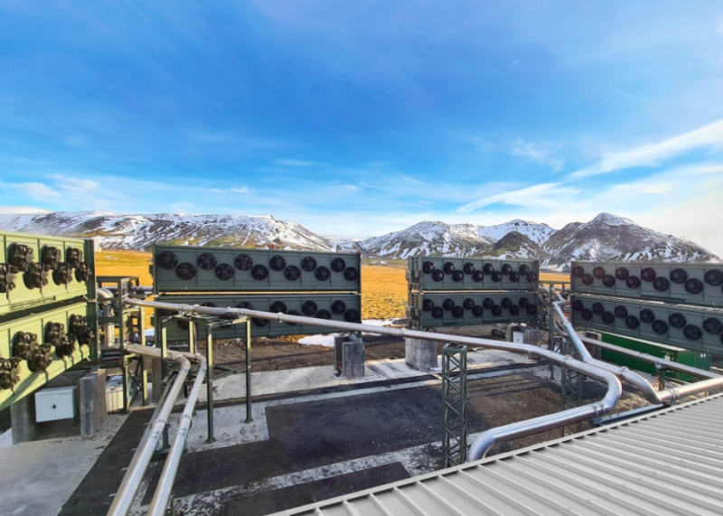
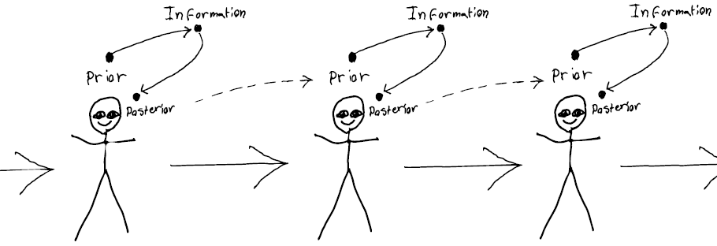
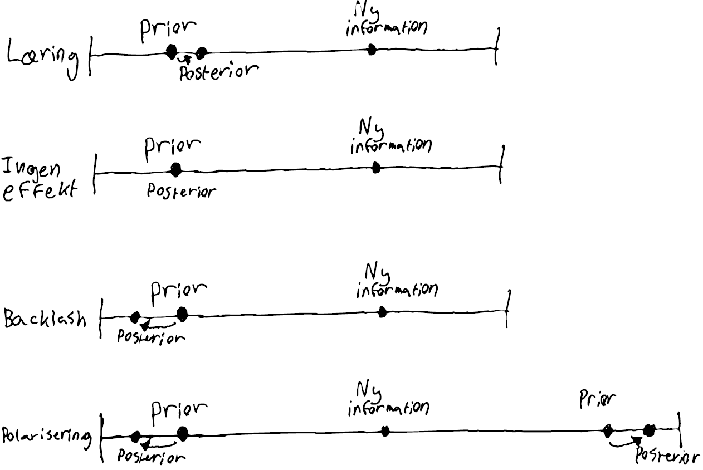
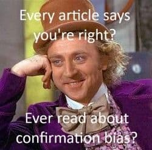
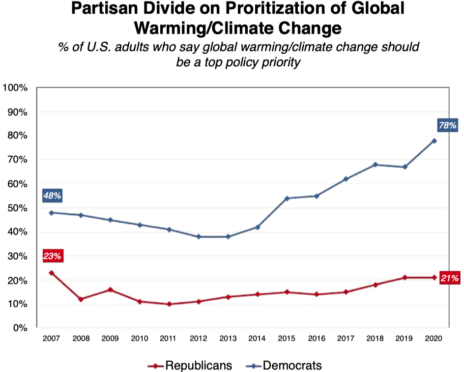
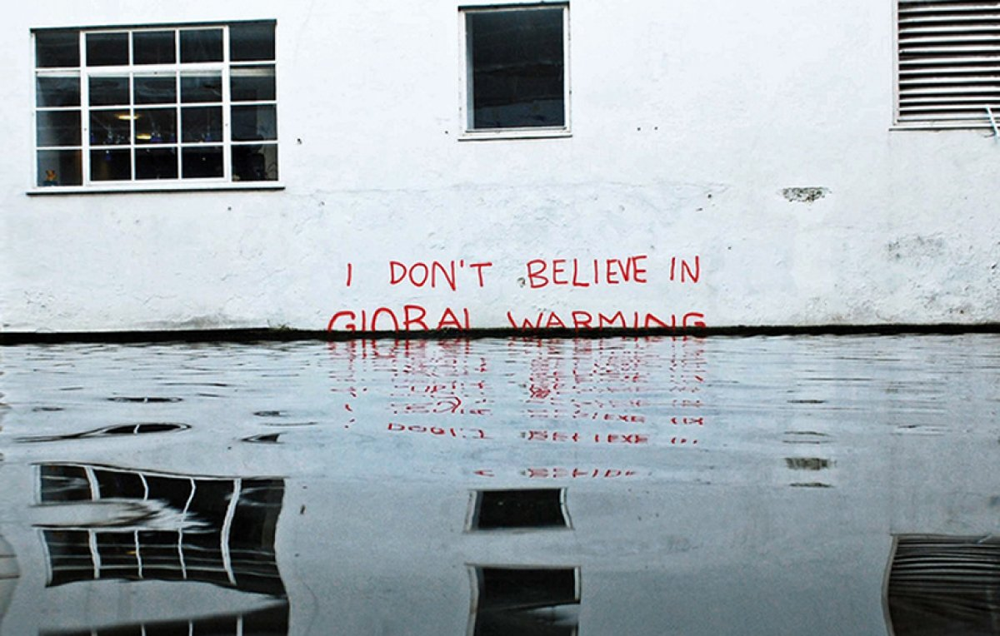

```{r, include = FALSE}
pacman::p_load(tidyverse, 
               knitr, 
               lubridate, 
               kableExtra,
               xaringan,
               xaringanExtra)

knitr::opts_chunk$set(echo = FALSE, 
                      fig.align = "center", 
                      cache = TRUE,
                      out.width="1000px"
)

Sys.setlocale(locale = "da_DK.UTF-8")

xaringanExtra::use_tile_view()
```

```{r xaringan-themer, include=FALSE, warning=FALSE}
library(xaringanthemer)

style_mono_accent(
  # Colors
  base_color = "#8b2325",
  text_color = "#000000", 
  link_color = "#808080", 
  text_bold_color = "#8b2325",
  title_slide_background_color = "#8b2325",
  title_slide_text_color = "#FFFFFF",
  colors = c("white" = "#FFFFFF", "black" = "#000000", "grey" = "#808080"),
  # Fonts
  text_bold_font_weight = "normal",
  text_font_base = "sans-serif",
  text_font_google = google_font("Metrophobic"),
  code_font_google = google_font("Metrophobic"),
  header_font_google = google_font("Metrophobic"),
  base_font_size = "16pt",
  text_font_size = "16pt",
  code_font_size = "16pt",
  code_inline_font_size = "16pt",
  header_h1_font_size = "30pt",
  header_h2_font_size = "20pt",
  header_h3_font_size = "20pt"
)
```

# Velkommen til mere holdningsdannelse

**Hvad er det, vi gerne vil kunne forstå og forklare?**

- Endnu bedre forståelse for **din skøre onkel**, dig selv og dine politiske modparter

--

- Hvorfor kan to personer, der læser den samme artikel (fx om vacciner eller klima), drage helt **forskellige konklusioner**? 

--

- Hvorfor kan to personer blive **eksponeret for vidt forskellig information** om et emne?

--

- Hvilke **psykologiske tilbøjeligheder og biases** spiller en rolle og hvordan?   

--

- Hvordan kan det lede til (og dermed også forklare) bestemte mønstre i **den offentlige mening**, fx polarisering?

---

# Velkommen til mere holdningsdannelse

**Hvad er det, vi gerne vil kunne forstå og forklare?**

```{r, out.width="50%"}
include_graphics("media/meme2.jpg")
```

--

- Er ekstrem kulde et argument eller bevis *imod* global opvarmning? For en klimaforandringsbenægter, måske!

???

Prior attitude effect: En klimabenægter vurderer ekstrem kulde som brugbar evidens, hvis han ikke tror på global opvarmning. Men vurderer det som ubrugelig, hvis han tror på global opvarmning.

Disconfirmation bias: En ikke-benægter vil bruge længere tid på at tænke over og modargumentere mod, at lokal kulde skulle have nogen bevismæssig værdi. (En klimabenægter vil omvendt tænke mere grundigt over argumenter mod statistisk videnskabelig evidens - fx ved at argumentere ud fra ekstrem kulde).

Bayesiansk opdatering: Global opvarmning bliver mere og mere usansynligt (og dermed troen på det mindre) efterhånden, som man oplever flere kolde vintre. Omvendt med ekstrem varme.   
---

# Over- og tilbageblik

- Zaller's **Receive-Accept-Sample** (RAS)-model

    - Tænk på min tegning, information og elitediskurs, politisk bevidsthed, prædispositioner, tilgængelighed og sampling, holdningsudsagn 

    - Holdningsdannelse som **process**, der starter med **information**, som måske modtages og forstås (afhænger af politisk bevidsthed), måske accepteres og huskes (afhænger af prædispositioner), så det måske er tilgængeligt i den situation, hvor der skal udtrykkes en **holdning**

--

- Ofte **elitedominerede holdninger** og polarisering - i hvert fald på klimaområdet i USA (Tesler 2018)

--

- I dag fortsætter vi ad samme spor &rarr; klare paralleller, men også markante forskelle 

--

- Mere hardcore **mikroteori** &rarr; forstå **menneskers psykologi** og informationsbehandling for at forstå **individuel holdningsdannelse** 

--

- (Men også bruge det til at forklare udviklinger på makroniveau, den offentlige mening, polarisering, etc.)

---
class: middle

# Dagens hovedpointe: Vi mennesker er tilbøjelige til (ofte ubevidst) at behandle ny information på en måde, der beskytter vores eksisterende holdninger frem for at hjælpe os frem til den mest "korrekte" holdning

--

&rarr; Vi kalder dette for **motivated reasoning**, hvilket dækker over de tre mekanismer **confirmation bias**, **prior attitude effect** og **disconfirmation bias**

---
class: middle

.pull-left[
<br><br>
> "[I]t is perfectly reasonable to give heavy weight to one’s own carefully constructed attitudes [...] attitudes may be thought of metaphorically as __possessions to be protected__" (Taber & Lodge 2006: 767)
]

.pull-right[
```{r}
include_graphics("media/possessions.jpg")
```
]

---

# Ugens tekster

**Hvad, hvorfor?**

Ikke så mange sider denne uge, men mere tekniske:

1. Taber & Lodge (2006) - **klassiker** i politisk psykologi (motivated reasoning) og genialt **eksperiment**

2. Druckman & McGrath (2019) - ny oversigt over **motivated reasoning** med fokus på klima, begrebsafklaringer og udfordringer

3. Damsbo-Svendsen (2021) - empirisk eksempel på en **heuristik**, personlige vejrerfaringer, der påvirker klimaholdningsdannelse i Europa

---
class: middle, title-slide

# Plan for resten af forelæsningen

1. Motivated reasoning: Introduktion og centrale begreber (med afsæt i D&M)

2. Gennemgang af eksperimentet i Taber & Lodge (2006)

3. Evidens for motivated reasoning på klimaområdet og udfordringer for teorien (tilbage til D&M) 

4. Skift til heuristikker &rarr; Damsbo-Svendsen (2021) og generelt

5. Overblik og opsamling

*Spørgsmål undervejs &rarr; bit.ly/dak2-spørgsmål (Google Docs)*

---

# Druckman & McGrath (2019)

Relativt svær og kompakt tekst, men fantastisk **reservoir af skarpe begrebsafklaringer**

```{r, out.width="45%"}
include_graphics("media/dm0.png")
```

---

# Druckman & McGrath (2019)

- D&M er (også) interesseret i **den polariserede klimadebat** &rarr; hvorfor skaber klima så stor splittelse i den amerikanske befolkning?

--

- En meget udbredt forklaring er **"motivated reasoning"**

    - **Motivated reasoning** = motivated skepticism = (politisk) motiveret tænkning

--

- Hvad betyder **motiver** her? 

--

    - En slags formål med at sætte hjernen i arbejde 

    - **Accuracy** (non-directional) - mål om **nøjagtighed** - at nå frem til den "bedste" konklusion, "sandheden"
    
    - **Directional** (partisan) - **politiske mål** - at beskytte eller bestyrke eksisterende holdninger, identitet, mv.

--

- D&Ms er også lidt (selv)kritiske over for motivated reasoning - det vender vi tilbage til!

---

# Bayesiansk opdatering

- D&M forklarer motivated reasoning ud fra et såkaldt **bayensiansk framework**

- Det gør vi også til dels

--

- Vigtig **disclaimer**: 

    - Man kan godt forstå motivated reasoning *uden denne bayensianske tilgang*
    
    - Det kan virke meget **teknisk**, fordi det er baseret på matematik (sandsynlighedsteori og Bayes' teorem)
    
    - Men giver os et godt billede: _Holdningsdannelse som løbende **opdatering** af holdninger_
    
    - Bayesiansk opdatering er et **udbredt koncept**, som I givetvis vil møde senere (også en gren af statistik)
    
    - Vi kan godt **forstå bayensiansk opdatering uden matematikken** &rarr; det er *det*, vi starter med
---

# Bayesiansk opdatering

- Oversat til holdningsdannelse er **den grundlæggende indsigt i Bayes' teorem** simpel: 

--

> Sandsynligheden for, at man ændrer holdning i lyset af **ny information**, og måden man ændrer holdning, *afhænger af ens forudgående holdning*

--

- Den "opdaterede" holdning (**"posterior"**) er betinget af ens forudgående holdning (**"prior"**)

--

- Denne *prior* kan være baseret på hvad som helst og (fx) være stærk eller svag

--

**Bayesiansk opdatering:**

1. **Prior**/forudgående opfattelse

--

2. Indsamling af ny information

--

3. Ny information inkorporeres (måske) i **opdateret opfattelse** afhængigt af:

    - *styrke/sikkerhed* ved eksisterende holdning
    - *styrke/sikkerhed* ved ny information (= troværdighed)

---

# Bayesiansk opdatering - eksempler

**Ensrettet cykelsti** 

Jeg løber på arbejde ved cykelstien rundt om søerne. Jeg tror, at der er ensrettet i min retning. Jeg er ikke meget sikker. Der kommer en cykel imod mig. Det er lidt, men ikke meget usandsynligt, hvis min prior var sand. Jeg opdaterer en smule i retning af ikke-ensrettet. Der kører to cykler imod mig. Det begynder at være usandsynligt, hvis min prior er sand. Meget mere sandsynligt, hvis min prior var falsk. Jeg opdaterer mere i retning af, at der ikke er ensrettet. Til sidst ser jeg et skilt (høj troværdighed). Jeg opdaterer helt hen til "dobbeltrettet".  

```{r, out.width="10%"}

```

**CCS og klima**

Jeg tror ikke på, at CCS (carbon capture and storage) kan løse problemet med udledning af klimagasser. Der skal skrappere midler til (generel omstilling af samfundet). Jeg læser en artikel, der interviewer forskere og virksomheder, der arbejder på at sætte CCS i produktion, samt klimaministeren, der siger, at CCS er en afgørende teknologi. Jeg opdaterer (potentielt men ikke nødvendigvis!) min holdning en smule i retning af, at CCS er en del af løsningen. 

```{r, out.width="10%"}

```

???

Hvis min *prior* var, at CCS var en silver bullet i klimaproblemet, havde jeg nok ikke opdateret, fordi den nye information fuldstændigt matchede min prior (men måske en styrkelse af holdningen).

---

# Bayesiansk opdatering

Det vigtigste at tage med videre er billedet af **holdningsdannelse som løbende opdatering** af eksisterende holdninger (priors) i lyset af nye informationer

```{r, out.width="95%"}

```

---

# Bayesiansk opdatering - udfald

.pull-left[

1. **Læring:** Den opdaterede holdning bevæger sig i retning af informationen 

2. **Ingen opdatering:** Den opdaterede holdning er lig med den tidligere holdning (prior = posterior)

3. **Backlash (bagslag):** Den opdaterede holdning bevæger sig i modsat retning af informationen
]

--

.pull-right[
```{r}

```
]

--

- **Polarisering:** Når personer/grupper med forskellige priors *opdaterer i modsatte retninger* pba. samme information 


---

# Motivated reasoning

- Okay ... Vores eksisterende opfattelser (*priors*) påvirker altså vores holdningsdannelse

--

- Det er også hovedbudskabet i motivated reasoning

--

- Al tænkning er motiveret af bestemte mål (behøver ikke være klart for individet selv)

    - (a) **Nøjagtighed** - at nå frem til den "korrekte" konklusion om verdens tilstand

    - (b) **Politisk mål** - at nå frem til en forudbestemt konklusion om verdens tilstand

---

# Motivated reasoning - mål om nøjagtighed

- Motiveret af mål om **nøjagtighed** - at nå frem til den "korrekte" konklusion om verdens tilstand

--

- Ens **prior** påvirker hverken indsamlingen af ny information eller behandlingen af ny information

--

- Det er det rene, rationelle ideal 

--

- Ikke altid forkert, men ofte

--

- Kan føre til normativt ønskelige resultater (læring af "sandheden")

--

- Men gør det ikke nødvendigvis - et motiv er ikke nok, og der er meget der kan gå galt

???

Hvad der kan gå galt: Kontekst og vurdering af kildens troværdighed, kognitive biases 

---

# Motivated reasoning - politisk mål

- Motiveret af politisk mål (*directional* eller *partisan*) - at nå frem til en forudbestemt konklusion om verdens tilstand

    - Mao. at beskytte sin *prior*

--

- Ens **prior** påvirker indsamlingen og/eller behandlingen af ny information

--

- Kan altså påvirke **selve informationen** (indholdet), man eksponeres for, den opfattede **troværdighed** og mobilisering af **modargumenter** 

--

- Det kan forklare *forskelle* i holdningsdannelse (endda ved eksponering for samme information)

--

- Det er dette - tænkning motiveret af politisk mål - vi kalder for **"motivated reasoning"**

---
class: middle

# De tre mekanismer

1. Confirmation bias

2. Prior attitude effect

3. Disconfirmation bias

---

# De tre mekanismer

## 1. Confirmation bias

> "A tendency to seek out information that confirms one’s prior beliefs"

- Når man indsamler information, vælger man kilder, som vil være tilbøjelige til at bekræfte ens holdning (*selektiv eksponering*) - og kan kun påvirkes af de information, man eksponeres for 

&rarr; *Indsamling af information*

```{r, out.width="22%"}

```


---

# De tre mekanismer

## 2. Prior attitude effect

> "Perceived strength of new information is a function of its relationship to one’s prior belief"

- Man stoler mere på information, som "giver mening" i forhold til ens eksisterende opfattelser - og påvirkes derfor også mere

&rarr; *Behandling af information*

---

# De tre mekanismer

## 3. Disconfirmation bias

> "Greater scrutiny and counter-argumentation of information contrary to one’s prior beliefs (relative to information consistent with one’s prior beliefs)"

- Man bruger flere kræfter på at efterprøve og modargumentere information, der udfordrer ens holdning - og påvirkes derfor også mindre

&rarr; *Behandling af information*

--

***

## "Bias"

- **Bias** er altid relativt i forhold til et "unbiased" udgangspunkt 

- Her er *bias* at have et politisk motiv, der påvirker ens behandling af information

- Bias i forhold til informationsbehandling styret af motiv om **nøjagtighed** (*unbiased*) 

- (Også et allestedsnærværende begreb i statistik)

---

# Motivated reasoning - empirisk set

- Okay. Vi begynder at forstå motivated reasoning.

- Men det er stadig abstrakt!

- Lad se på en **empirisk undersøgelse**, der tester de tre mekanismer **&darr;**

<br>
```{r, out.width="60%"}
include_graphics("media/taberlodge0.png")
```

---
class: middle, title-slide

1. .grey[Motivated reasoning: Introduktion og centrale begreber]

2. Eksperimentet i Taber & Lodge (2006)

3. .grey[Evidens for motivated reasoning på klimaområdet?]

4. .grey[Heuristikker]

5. .grey[Overblik og opsamling]

*Spørgsmål undervejs &rarr; bit.ly/dak2-spørgsmål (Google Docs)*

---

# Taber & Lodge (2006)

- **Klassiker** i politisk psykologi og statskundskab (citeret 3733 gange)

- Opstiller og tester de tre motivated reasoning-mekanismer empirisk

- Elegant forskningsdesign &rarr; laboratorieeksperiment 

```{r, out.width="60%"}
include_graphics("media/taberlodge0.png")
```

---

# Forskningsdesign

- (Op til) 136 deltagere rekrutteret blandt statskundskabsstuderende (W.E.I.R.D?)

- To politiske emner: *Affirmative action* og *gun control*

--

- Deltagerne svarer på spørgsmål og løser opgaver på computere: 

    - Først holdninger til emnet
    - Så øvelser &rarr; "infoboard", vurdering af argumenters styrke, tanker om argumenter
    - Til sidst holdninger til emnet igen

--

- Deltagerne instrueres til at være fair og grundige, når de læser argumenter for/imod (&rarr; nøjagtighed)

--

- T&L analyserer, hvordan forskellige typer deltagere løser opgaverne og om deres holdninger ændrer sig

--

- Skelner mellem deltagere, der er:

    - **enige/uenige**
    - mere eller mindre **sofistikerede** (low/high knowledge, politisk bevidsthed hos Zaller) = *mulighed* for motiveret tænkning
    - har stærke eller svage **priors** = *grad* af motivation 

---
class: middle

# Taber & Lodge's seks hypoteser 

## Motivated reasoning - mekanismerne

- **H1 (prior attitude effect):** Man vurderer argumenter, der understøtter ens eksisterende holdning (prior), som stærkere/mere overbevisende

- **H2 (disconfirmation bias):** Man vil bruge mere tid og omtanke på at argumentere *imod* påstande, der er i modstrid med ens egen eksisterende holdning (prior) 

- **H3 (confirmation bias):** Man søger i højere grad information fra afsendere, man forventer vil understøtte ens egen holdning (prior)

---
class: middle

# Taber & Lodge's seks hypoteser 

## Motivated reasoning - konsekvens og variation

- **H4 (attitude polarization):** Selvom man udsættes for balanceret information om et emne (gode argumenter for og imod), vil ens holdning (posterior) blive mere ekstrem (polariseret) af informationen 

- **H5 (attitude strength effect):** Motivated reasoning (H1-H3) er stærkest for dem med stærke eksisterende holdninger (priors)

- **H6 (sophistication effect):** Motivated reasoning (H1-H3) er stærkest for dem med stor viden, forståelse for emnet, kognitive ressourcer 

---

# Prior attitude effect

> **H1 (prior attitude effect):** Man vurderer argumenter, der understøtter ens eksisterende holdning, som stærkere/mere overbevisende (prior attitude effect)

- Deltagerne præsenteres for argumenter for og imod og vurderer "så objektivt som muligt", hvor gode argumenterne er fra 0-100

```{r, out.width="50%"}
include_graphics("media/taberlodge2.png")
```

--

- Tanken er, at deltagerne vil vurdere argumenter som stærkere, hvis de er enige (svagere, hvis de er uenige) 

---

# Prior attitude effect

```{r, out.width="65%"}
include_graphics("media/taberlodge1.png")
```

--

- Primært: Forskelle mellem vurdering af Pro/Con (nabosøjler) for personer, der selv er Pro/Con
- Sekundært: Forskelle afhængigt af **sofistikation** og **styrke af prior**

---

```{r, out.width="75%"}
include_graphics("media/taberlodge4.png")
```

**&rarr; Understøtter H1 (prior attitude effect), H5 (attitude strength effect) og H6 (sophistication effect)**

---

# Disconfirmation bias

> **H2 (disconfirmation bias):** Man vil bruge mere tid og omtanke på at argumentere *imod* påstande, der er i modstrid med ens egen eksisterende holdning (prior) 

--

- Folk vil med det samme acceptere argumenter, der bekræfter dem, men *aktivt modargumentere* inkongruent information

- De vil **bruge mere tid** på at læse og tænke over argumenter, de er uenige med

- Vil også variere med sofistikation og styrke af prior

---

```{r, out.width="65%"}
include_graphics("media/taberlodge5.png")
```

- Primært: **Grå søjler** sammenlignet med sorte (**læsetid for modstridende argumenter**)
- Sekundært: Fokus på dem med stærke priors (**strong**) og/eller **high knowledge** (sofistikation)

---

```{r, out.width="65%"}
include_graphics("media/taberlodge5.png")
```

- På tværs af alle grupper er forskellen lille (1–2 sekunder)
- For de sofistikerede og dem med stærke holdninger er forskellen stor (4–7 sekunder)

---

# Hvad brugte de tiden på? 

- Bruger deltagerne tiden på at tænke sig om og argumentere *imod* inkongruent information? 

--

- T&L spurgte ind til **deltagernes tanker** omkring de argumenter, de havde læst og vurderet:

```{r, out.width="60%"}
include_graphics("media/taberlodge6.png")
```

---

# Hvad brugte de tiden på? 

.pull-left[
- Resultatet: 

    - inkongruente argumenter medførte langt flere tanker end kongruente argumenter gjorde 
    
    - det var nærmest udelukkende tanker, der udfordrede argumentet
    
    - både sofistikerede og usofistikerede deltagere udtrykte tanker, der udfordrede inkongruente argumenter og understøttede kongruente argumenter 
    
    - men sofistikerede var mest biased
]

.pull-right[
```{r}
include_graphics("media/taberlodge6.png")
```
]

--

- Indikation på, at man grundigt evaluerer argumenter imod egen holdning for at udfordre dem og beskytte sin prior

---

# Confirmation bias

.pull-left[

- Når folk har mulighed for det, vil de vælge informationskilder, som de tror vil være ikke-truende, vil give dem information/argumenter, der støtter dem deres holdning

- Operationaliseres som andelen af valgte argumenter (8 ud af 16 mulige), som er fra kilder, de typisk er enige med (%)
]

.pull-right[
```{r}
include_graphics("media/taberlodge3.png")
```
]

---

# Confirmation bias

```{r, out.width="57%"}
include_graphics("media/taberlodge7.png")
```

- Primært: Forskelle på Pro/Con (argumenter der kongruente eller inkongruente med egen holdning)
- Sekundært: Særligt fokus på "High Knowledge" (høj sofistikation)

---

# Confirmation bias

.pull-left[
- Resultatet:

    - I alle grupper udvalgte deltagerne flere understøtende (Pro) end udfordrende (Con) argumenter

    - Forskellen - og dermed bias - var særligt udtalt for de sofistikerede deltagere:

    - "When given the chance, sophisticated respondents selected arguments from like-minded groups 70–75% of the time"

- Bemærk: Argumenter vælges pba. kilden, ikke indholdet (kan dermed fx være udtryk for større tillid til sandhedsværdien &rarr; nøjagtighed)
]

.pull-right[
```{r}
include_graphics("media/taberlodge7.png")
```
]

---

# Holdningspolarisering (H4)

- Personer med forskellige priors kan divergere, selvom de præsenteres for nøjagtigt sammme information  

--

- Deltagere, som var usofistikerede, havde svage priors eller ikke havde udvist bias i de andre øvelser polariserede *ikke*, men:

--

> "*we find __strong evidence of attitude polarization for sophisticated participants__, those with __strong priors__, and (most importantly) those who were __biased in their information processing__*" 

--

- Mao. kan motivated reasoning forklare **polarisering** blandt sofistikerede (dem med høj politisk bevidsthed)

---

# RAS-modellen og MR: Forskelle og ligheder (1)

- Lighed: Samme grundlæggende spørgsmål (hvor kommer holdninger/holdningsforskelle fra)

--

- Lighed: Begge antager at holdninger formes og forandres som funktion af **information**

--

- Forskel: MR beskæftiger sig ikke med, **hvor informationen kommer fra** (informationslandskabet, kommunikation, elitediskurs). Ej heller med generelle forskelle i eksponering over for politisk information (politisk bevidsthed)   

--

- Forskel: MR er mere **psykologi**, mere fokuseret på, hvordan hjernen (informationsbehandling) faktisk fungerer, mere mikroniveau

--

- Lighed: **Modstandsantagelsen** ligner meget en forsimplet version af MR. Man står imod ny information, der er *for* inkongruent (prior attitude effect plus disconfirmation bias). MR zoomer ind omkring modstandsantagelsen (og til dels modtagelse). Derfor heller ikke inkompatible!  

--

- Forskel: Men det er kun i MR, at der er mulighed for "**backlash**", ikke hos Zaller, hvor det er en skala fra ikke-accept til fuld accept. Mere komplekse mekanismer og udfald i MR.

---

# RAS-modellen og MR: Forskelle og ligheder (2)

- Forskel: I RAS er det kun dybereliggende prædispositioner (ideologi, værdier, osv.), der regulerer informationsbehandlingen. I MR er det også eksisterende holdning til emnet. 

--

- Forskel: For Zaller er der intet **"formål"** (motivation) forbundet med informationen, man modtager og accepterer. Variablene spiller blot ind hver især og giver det outcome, det nu engang gør. I MR er der et mål, som de andre "variable" mobiliseres for at opnå. 

--

- Forskel: Zaller er nærmest udelukkende baseret på **kognition**. MR lægger hovedvægt på **affekt** (T&L kalder det "affect-driven motivated reasoning"). De biases, der præger vores informationsbehandling drives af lynhurtige, automatiske affektive processer (like/dislike, mavefornemmelse), som styrer retning og styrke på biases i (kognitiv) informationsbehandling. Hvis det ikke vækker affekt, vækker det ikke motivation og dermed heller ikke bias. 

---

# En samlet model

.pull-left[
```{r}
include_graphics("media/taberlodgemodel.png")
```
]

.pull-right[
```{r, out.width="60%"}
include_graphics("media/taberlodgebook.jpg")
```
]

???

```{r, out.width="50%"}
include_graphics("media/taberlodgemodel2.png")
```

---
class: title-slide, middle

# Okay, lad os lige kortvarigt vende tilbage til Druckman & McGrath (2019)

1. .grey[Motivated reasoning: Introduktion og centrale begreber]

2. .grey[Eksperimentet i Taber & Lodge (2006)]

3. Evidens for motivated reasoning på klimaområdet?

4. .grey[Heuristikker]

5. .grey[Overblik og opsamling]

*Spørgsmål undervejs &rarr; bit.ly/dak2-spørgsmål (Google Docs)*

<br>


---

# Hvad var egentlig D&Ms hovedbudskab?

--

- **Evidensen for motivated reasoning på klimaområdet i USA er faktisk _ikke_ så klar**

    - Trods adskillige studier (inkl. eksperimenter), der viser, at fx demokrater/republikanere behandler information forskelligt og når frem til forskellige konklusioner

    - Trods at det ville kunne __forklare polarisering__ i klimaholdninger over tid:

--

.pull-left[
```{r, fig.cap="Kilde: Bayes & Druckman (2021)"}

```
]

--

.pull-right[
- Så kan man ikke udlede, hvilke mål folk faktisk er motiverede af

    - **Vi kan ikke direkte observere motiver!**
]

---

# Hvad var egentlig D&Ms hovedbudskab?

- Alternativ forklaring: Motiveret om mål **nøjagtighed** - men med forskellige opfattelser af, hvad der er (u)troværdige kilder til information af høj kvalitet
    
    - "For example, accuracy-motivated people may differ in the standing trust they place in scientists" (112)

--

- Folk, der er motiveret af at finde frem til "sandheden", kan nå frem til noget, der ligger langt fra den videnskabelige konsensus pga. "*inability to detect 'bad information'*" (112)

--

- **Vi kan ikke se forskel i praksis!**

    - De kilder, folk synes er troværdige, er dem, de deler holdninger og værdier med (og omvendt)
    
    - Når man lægger vægt på information fra kilder, man deler værdier med, kan det (a) være udtryk for et mål om at beskytte sine holdninger (motivated reasoning) eller (b) at det er den **mest troværdige kilde** uanset ens holdninger

    - = "the motivated reasoning observational equivalence problem"

---

# Kritik af kritikken 

- Meeen! Det betyder ikke, at teorien tager fejl. Det er bare ekstremt svært at finde en "smoking gun"

--

- **So what?**

    - Man kunne godt forestille sig, at de to (holdninger og opfattet kildetroværdighed) også er rodet grundigt sammen i den virkelige verden
    
    - Det er da interessant nok at kunne sige, at det er en af de forklaringer, der gælder (eller en kombination)
    
    - Tydeligt at **forskelle i informationsbehandling er afgørende**

--

- D&M giver ikke rigtigt et bud på, hvor stort "problemet" er. Hvor sandsynligt er det, at kildetroværdighed er en vigtig(ere) forklaring? Eller er det bare en akademisk øvelse?

--

- Lidt irriterende, at de gør en så overbevisende og relativt overskuelig teori meget mere kompliceret ...  

---

# Mere kritik af motivated reasoning?

- Snak sammen i 1-2 minutter

--

- Agnostisk omkring, hvor informationen kommer fra &rarr; mangler måske lidt blik for *det politiske*

--

- Tingene blev meget komplekse ift. RAS-modellen - men hvor meget vandt vi?

--

- Antager, at vi har en forholdsvist klar **prior** (eksisterende holdning), som spiller en afgørende rolle. Men vi ved fra Zaller m.fl., at de fleste *ikke* har klare holdninger til særligt meget

--

- Springer den lidt let henover, hvorfor motivationen er der? Ofte fremføres **identitet** og ønsket om at bevare basis for tilknytning til en social gruppe, fx parti. (D&M diskuterer det, men det er ikke en integreret del af teorien)

--

- Kan godt virke lidt "selektivt", at der lige præcis er to motiver og tre mekanismer. Ikke at det er forkert, og det er muligvis de vigtigste, men...

--

Hvis I selv har flere kritikpunkter, så tag dem endelig med til holdtimen

---
class: title-slide, middle

1. .grey[Motivated reasoning: Introduktion og centrale begreber]

2. .grey[Eksperimentet i Taber & Lodge (2006)]

3. .grey[Evidens for motivated reasoning på klimaområdet?]

4. Heuristikker

5. .grey[Overblik og opsamling]

*Spørgsmål undervejs &rarr; bit.ly/dak2-spørgsmål (Google Docs)*

---

# Damsbo-Svendsen (2021) - The Local Warming Effect

.pull-left[
<br><br>
```{r}

```
.center[*"Oh god ... weird ... how did that ...?"*]
]
.pull-right[
```{r}
include_graphics("media/damsbopaper.png")
```
]

---

# Damsbo-Svendsen (2021) - The Local Warming Effect

.pull-left[
- RQ: Hvordan påvirker usædvanlige **temperaturer** europæernes **holdninger** til klimaforandringer?

    - Direkte **oplevelser og erfaringer** med vejret 
    - Uafhængigt af medier og eliter (?)
    - Heuristik!

- **Local Warming Effect** er, når "*deviations in the day’s temperature affect individuals’ global warming beliefs*"

- Inspireret af Egan & Mullin (2012) m.fl. (USA)
]

.pull-right[
```{r}
include_graphics("media/damsbopaper.png")
```
]

---

# Data

.pull-left[

- [European Social Survey runde 8 (2016)](https://www.europeansocialsurvey.org/data/download.html?r=8) med masser af klimaspørgsmål

- Afhængig variabel: *Klimabevidsthed* (0-100) - **indeks** af 6 spørgsmål

- Uafhængig variabel: **Temperatur** over 7 dage ift. "normal" over 30 år

    - Temperaturer [observeres på landeniveau](https://www.ecad.eu/) og matches med respondenter i hvert land

- I nogle lande ikke plausibelt at tale om en "national temperatur" pga. enorm variation

    - ekstremt store eller bjergrige) lande udelukkes &rarr; 12 lande tilbage (ikke DK) 
]

.pull-right[

```{r kort, warning = FALSE, message = FALSE, dpi=300}
pacman::p_load(tidyverse, sf)

rnaturalearth::ne_countries(continent = "Europe") %>% 
  st_as_sf(crs = 4326) %>%
  select(name) %>% 
  filter(name != "Russia") %>% 
  mutate(temperature_variance = case_when(str_detect(tolower(name), "austria|switz|russia|spain|norway|sweden|israel|slovenia") ~ "high",
                                          str_detect(tolower(name), "finland|france|italy|germany|united kingdom|poland|iceland|hungary|netherland|estonia|lithuania|ireland") ~ "low",
                                          str_detect(tolower(name), "belgium|portugal|czech") ~ "no_weather",
                                        TRUE ~ "no_data")) %>% 
  st_crop(st_bbox(c(xmin = -50, xmax = 30, ymin = 10, ymax = 70))) %>% 
  select(temperature_variance) %>% 
  ggplot() +
  geom_sf(aes(fill = factor(temperature_variance, 
                            levels = c("low", "high", "no_weather", "no_data"), 
                            labels = c("Med i analysen", "Udelukket pga. ekstrem vejrvariation", "Ingen vejrdata", "Ingen surveydata"))), 
          color = "black") +
  ggthemes::theme_map() +
  scale_fill_manual(values = c("#00CC66", "#CC0000", "grey35", "grey65")) +
  labs(fill = NULL) 
```
]

---

# Resultater

.pull-left[
- Statistisk regressionsanalyse af **sammenhængen mellem temperaturer og holdninger**

- Positiv sammenhæng!

- Argument: For et givet land og tidspunkt er temperaturudsving *så-godt-som-tilfældige*

    - Derfor: Sammenhæng mellem temperatur og klimaholdninger kan tolkes kausalt &rarr; **vejroplevelser _forårsager/øger_ klimabevidsthed**

- Svag effekt ... men alle påvirkes af vejret hele tiden

]

.pull-right[
```{r}
include_graphics("media/damsboplot.png")
```
]

---

# Resultater

- Er der forskelle i, *hvem* der påvirkes af vejret?

- **Uddannelsesniveau** (politisk bevidsthed, sofistikation) og **partitilhørsforhold** (motiv)  

```{r, out.width="80%"}
include_graphics("media/figure2_interactions_education_party.jpg")
```

- Svag tendens, men **nej**. Alle påvirkes! 

---

# Resultater

- Er det udelukkende en **direkte effekt af egne erfaringer?** 

    - Spiller medierne ingen rolle?
    - Det er ikke ligetil at se en sammenhæng mellem vejr og klima
    - **Medier/eliter** kunne spille en rolle ved at frame/italesætte vejrerfaringer
    - &rarr; så ville effekten være større ved højere nyhedsforbrug

--

```{r, out.width="70%"}
include_graphics("media/figure3_interaction_news.jpg")
```

- Svag tendens, men konklusion: Det *er* en **direkte effekt af erfaring** (nyhedsforbrug gør ingen forskel)

---

# Fortolkning

- Er vejrerfaringer en type af information i sig selv? (Ja)

- Er det en kognitiv **heuristik**? (Også ja)

- Er det ... en tilfældighed? (Nej)

--

- Er det smart eller dumt/uforklarligt?

    - Opdatering af klimaholdninger i retning af videnskabelig konsensus (godt), men på baggrund af flygtige erfaringer, som videnskabsfolk ikke ville betragte som troværdig evidens (dårligt) (D&M: 112) 

    - Det kan være rationelt at reagere på sine omgivelser og direkte erfaringer og bruge den tilgængelige "information", selvom den er unøjagtig

    - Godt *for klimaet*, hvis the local warming effect "automatisk" skaber klimabevidsthed

---

# Kort om kognitiv heuristikker generelt

- Personlige **vejrerfaringer** er en blandt mange heuristikker

- Det er en genvej til at regne ud, huske eller være i stand at gætte på, hvordan det nu er med global opvarmning, osv. 

- En "billig" omend uperfekt informationskilde

--

## Baggrund

- Menneskers informationsbehandling er stærkt begrænset af kognitive ressourcer, tid, etc.  

- Derfor er vi blevet gode til at tage "smutveje", som gør os i stand til at træffe *nogenlunde* beslutninger med minimale kognitive strabadser 

- Dette kan endda forklare lav politisk bevidsthed &rarr; det kan simpelthen ikke betale sig at sætte sig ind i alting

--

- Og dog! Alle anvender heuristikker, men det er ikke alle, det "virker" lige godt for (Lau & Redlawsk 2001)    

---

# Kort om kognitiv heuristikker generelt - eksempler

1. **Partitilhørsforhold** (budskabet kommer fra Venstre, så jeg er sikkert enig...)

2. **Ideologi** (budskabet kommer fra en socialist, så jeg er sikkert enig...) 

3. __*Endorsements*__ (Greenpeace bakker op om budskabet, så jeg er sikkert enig...)

4. __Popularitet/*viability*__ (afsenderen er populær, så jeg er sikkert enig...)

5. __Udseende__ (budskabet kommer fra en smuk person, der ser klog og autoritativ ud, så jeg er sikker enig...) 

6. __Likeability a.k.a. affekt-heuristikken__ (uden at jeg helt ved hvorfor, kan jeg godt lide afsenderen, så jeg er sikkert enig...)

--

*** 

- Argumentet er **langt** eller **komplekst**, så det er sikkert godt (Taber & Lodge 2006)

- **Tilgængelighed** kan også forstås som en heuristik - at lægge (for) meget vægt på tilgængelige overvejelser

- Mere om heuristikker &rarr; Lau & Redlawsk (2001) og Tversky & Kahneman (1974)

---

class: title-slide, middle

1. .grey[Motivated reasoning: Introduktion og centrale begreber]

2. .grey[Eksperimentet i Taber & Lodge (2006)]

3. .grey[Evidens for motivated reasoning på klimaområdet?]

4. .grey[Heuristikker]

5. Overblik og opsamling

*Spørgsmål undervejs &rarr; bit.ly/dak2-spørgsmål (Google Docs)*

---

# Overblik - holdningsdannelsesteori

**Vi har været omkring Zallers RAS-model, motivated reasoning, framing, heuristikker, mv.**

--

- Meget orienteret mod **information** og informationsbehandling

--

- Fokuseret på marginale holdnings*ændringer* frem for "dannelse" i dybere, bredere forstand (bl.a. fordi vi gerne vil kunne *forandre*)

--

- Antagelse om at **mennesker grundlæggende er ens** - udover at de behandler information lidt forskelligt ... 

--

- Andre teorier lægger i stedet vægt på dybe, **fundamentale forskelligheder** - i holdninger og holdnings*dannelse* - pba. **biologi, moral, personlighed** mv.

    - *Se f.eks. Haidt (2012), Hibbing, Smith & Alford (2013), Smith et al. (2011), Mondak et al. (2010)*

--

- Vi har fokuseret meget på **individuelle processer** 

--

- Andre teorier fokuserer mere på netværkseffekter, interpersonel inflydelse osv.

    - *Se f.eks. Goldberg et al. (2019), Mutz (2002)*
    
---

# Overblik - holdningsdannelsesteori
  
- Der er også teori, der lægger mere vægt på **følelser, affekt mv.** frem for kognitive overvejelser

    - *Se f.eks. Brader (2005), Lodge & Taber (2013)*
    
- Der er også teori, der er mindre psykologisk og eksempelvis lægger mere vægt på **materiel egeninteresse** 

    - *Se f.eks. Margalit (2013), Sears et al. (1980)*
    
- Der er også teori, der lægger mere vægt på **socialisering, opvækst** og oprindelig "dannelse" af holdninger

    - *Se f.eks. Jennings, Stoker & Bowers (2009)*
    
---

# Opsummering

- Vi er tilbøjelige til at behandle ny information på en måde, der beskytter vores eksisterende holdninger frem for at hjælpe os frem til den mest "korrekte" holdning

      - Det kaldes **motivated reasoning** &rarr; vores tænkning er (sommetider) motiveret af et mål om at nå frem til en bestemt konklusion - ofte at beskytte vores holdninger 

--

- De tre vigtigste **mekanismer** er:

    - Confirmation bias, prior attitude effect og disconfirmation bias

--

- Motivated reasoning er en super stærk og udbredt teori

    - Men den kan være vanskelig at skelne *empirisk* fra andre forklaringer - fordi motiver ikke kan observeres

    - Det gælder også den polariserede klimadebat i USA

--

- **Heuristikker** (fx vejrerfaringer) er en **kognitiv genvej** til at træffe beslutninger

---

# Forbindelse til resten af DAK2

- Der kommer mere "politisk adfærd", mere individniveau (mikro)

- Flere teorier og analyser, der er relevante for holdningsdannelse (ofte mere specifikke områder/spørgsmål)

- Jeres viden om holdningsdannelse, informationsbehandling mv. kan også hjælpe jer til at forstå det

- Eksempler: Populisme og *landlig bevidsthed*, vælgeradfærd m.m.

---
class: middle, center

# Spørgsmål? 

[bit.ly/dak2-spørgsmål](https://bit.ly/dak2-spørgsmål)

```{r, out.width="50%"}
include_graphics("media/foxnews.jpg")
```

---
class: title-slide, center, middle

# Tak for denne gang!

```{r, out.width="50%"}

```