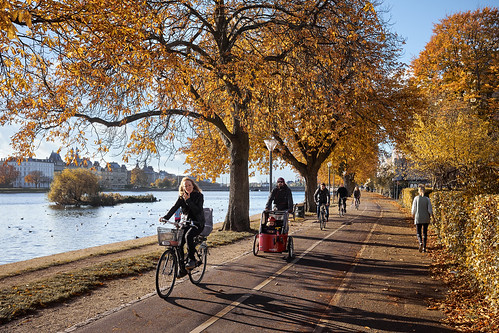

```{r, include = FALSE}
pacman::p_load(tidyverse, 
               knitr, 
               lubridate, 
               kableExtra,
               xaringan,
               xaringanExtra)

knitr::opts_chunk$set(echo = FALSE, 
                      fig.align = "center", 
                      cache = TRUE,
                      out.width="1000px"
)

Sys.setlocale(locale = "da_DK.UTF-8")

xaringanExtra::use_tile_view()
```

```{r xaringan-themer, include=FALSE, warning=FALSE}
library(xaringanthemer)

style_mono_accent(
  # Colors
  base_color = "#8b2325",
  text_color = "#000000", 
  link_color = "#808080", 
  text_bold_color = "#8b2325",
  title_slide_background_color = "#8b2325",
  title_slide_text_color = "#FFFFFF",
  colors = c("white" = "#FFFFFF", "black" = "#000000", "grey" = "#808080"),
  # Fonts
  text_bold_font_weight = "normal",
  text_font_base = "sans-serif",
  text_font_google = google_font("Metrophobic"),
  code_font_google = google_font("Metrophobic"),
  header_font_google = google_font("Metrophobic"),
  base_font_size = "16pt",
  text_font_size = "16pt",
  code_font_size = "16pt",
  code_inline_font_size = "16pt",
  header_h1_font_size = "30pt",
  header_h2_font_size = "20pt",
  header_h3_font_size = "20pt")

# Ekstra
style_extra_css(
  css = list(
    ".left-column" = list("width" = "33%",
                          "height" = "95%",
                          "float" = "left"),
    ".right-column" = list("width" = "65%",
                           "height" = "95%",
                           #"padding-left" = "1em",
                           "float" = "right")))
```

class: middle

.pull-left[
<br><br>
> "[I]t is perfectly reasonable to give heavy weight to one’s own carefully constructed attitudes [...] attitudes may be thought of metaphorically as __possessions to be protected__" (Taber & Lodge 2006: 767)
]

.pull-right[
```{r}
include_graphics("media/possessions.jpg")
```
]

---
class: middle

# Dagens hovedpointe: Vi mennesker er tilbøjelige til (ofte ubevidst) at behandle ny information på en måde, der beskytter vores eksisterende holdninger frem for at hjælpe os frem til den mest "korrekte" holdning

---

## Dagens hovedpointe: Vi mennesker er tilbøjelige til (ofte ubevidst) at behandle ny information på en måde, der beskytter vores eksisterende holdninger frem for at hjælpe os frem til den mest "korrekte" holdning

.pull-left[
```{r}
include_graphics("media/meme2.jpg")
```
]

--

.pull-right[
<br><br>
- Er ekstrem kulde et argument eller bevis *imod* global opvarmning? 

- For en klimaforandringsbenægter, måske! 

- **"Motivated reasoning"**
]

???

Prior attitude effect: En klimabenægter vurderer ekstrem kulde som brugbar evidens, hvis han ikke tror på global opvarmning. Men vurderer det som ubrugelig, hvis han tror på global opvarmning.

Disconfirmation bias: En ikke-benægter vil bruge længere tid på at tænke over og modargumentere mod, at lokal kulde skulle have nogen bevismæssig værdi. (En klimabenægter vil omvendt tænke mere grundigt over argumenter mod statistisk videnskabelig evidens - fx ved at argumentere ud fra ekstrem kulde).

Bayesiansk opdatering: Global opvarmning bliver mere og mere usansynligt (og dermed troen på det mindre) efterhånden, som man oplever flere kolde vintre. Omvendt med ekstrem varme.   

---

# Over- og tilbageblik

- Zaller's **Receive-Accept-Sample** (RAS)-model

- Holdningsdannelse som **process**, der starter med **information**, som måske modtages og forstås (afhænger af politisk bevidsthed), måske accepteres og huskes (afhænger af prædispositioner), så det måske er tilgængeligt i den situation, hvor der skal udtrykkes en **holdning**

- Begreber: information og elitediskurs, politisk bevidsthed, prædispositioner, tilgængelighed og sampling, holdningsudsagn

--

- Ofte **elitedominerede holdninger** og polarisering - bl.a. på klimaområdet i USA (Tesler 2018)

--

- I dag fortsætter vi ad **samme spor** &rarr; klare paralleller, men også markante forskelle 

    - Mere hardcore **mikroteori** &rarr; forstå **menneskers psykologi** og informationsbehandling for at forstå **individuel holdningsdannelse** 

    - (Men vi vil også bruge det til at forklare udviklinger i den offentlige mening, polarisering, etc.)

---

# Ugens tekster

**Hvad, hvorfor?**

Ikke så mange sider denne uge, men mere tekniske:

1. Taber & Lodge (2006) - **klassiker** i politisk psykologi (motivated reasoning) og genialt **eksperiment**

2. Druckman & McGrath (2019) - nyere oversigt over **motivated reasoning** med fokus på klima, begrebsafklaringer og udfordringer

3. Damsbo-Svendsen (2021) - empirisk eksempel på en **heuristik**, personlige vejrerfaringer, der påvirker klimaholdningsdannelse

---
class: middle, title-slide

# Plan for forelæsningen

1. Motivated reasoning: Introduktion og centrale begreber (med afsæt i D&M)

2. .grey[Eksperimentet i Taber & Lodge (2006)]

3. .grey[Motivated reasoning på klimaområdet og udfordringer for teorien (tilbage til D&M)]

4. .grey[Heuristikker: Damsbo-Svendsen (2021) og generelt]

5. .grey[Overblik og opsamling]

*Spørgsmål undervejs &rarr; bit.ly/dak2-spørgsmål (Google Docs)*

---
layout: true

# Druckman & McGrath (2019)

.left-column[

```{r}
include_graphics("media/dm0.png")
```
]

---

.right-column[
__Svær og kompakt tekst, men fantastisk reservoir af skarpe begrebsafklaringer__

- Også interesserede i **den polariserede klimadebat** i USA

    - En meget udbredt forklaring er **"motivated reasoning"**

- **Motivated reasoning** = motivated skepticism = (politisk) motiveret tænkning

- Lidt (selv)kritiske over for motivated reasoning - vender vi tilbage til
]

---

.right-column[
__Hvad betyder *motiver* i "motivated reasoning"?__ 

- En slags *formål* med at sætte hjernen i arbejde

- (1) Mål om **nøjagtighed** - *accuracy/non-directional* - at nå frem til den "bedste" konklusion, "sandheden"

- (2) **Politiske mål** - *partisan/directional* - at beskytte eller bestyrke eksisterende holdninger, identitet, mv.

]

---

.right-column[

__D&M forklarer motivated reasoning ud fra et såkaldt bayensiansk framework__

**Disclaimer:** 

- Kan virke meget **teknisk** (baseret på matematik, sandsynlighedsteori, Bayes' teorem)
    
- Motivated reasoning *kan* forstås uden bayensiansk tilgang
    
- Men godt at se **holdningsdannelse som løbende opdatering** og **udbredt koncept** (også en gren af statistik)

__Vi starter med bayensiansk opdatering, men *uden matematikken*__
]

---
layout: false

# Bayesiansk opdatering

- Oversat til holdningsdannelse er den grundlæggende indsigt i Bayes' teorem simpel: 

> Sandsynligheden for, at man ændrer holdning i lyset af ny information (og måden man ændrer holdning) **afhænger af ens eksisterende holdning**

--

- Mao. er den "opdaterede" holdning (**"posterior"**) betinget af den eksisterende holdning (**"prior"**)

--

- Den eksisterende holdning (*prior*) kan være stærk eller svag og være baseret på hvad som helst

---

# Bayesiansk opdatering - proces og udfald

.pull-left[
## Proces

1. Prior (eksisterende opfattelse)

2. Indsamling af ny information

3. Ny information inkorporeres muligvis i opdateret opfattelse (posterior) afhængigt af:

    - *styrke/sikkerhed* af prior
    - *styrke/sikkerhed* af ny information (= troværdighed)
]

--

.pull-right[
## Udfald
```{r}
include_graphics("media/opdatering1.png")
```
]

???

Udfald:

1. **Læring:** Den opdaterede holdning bevæger sig i retning af informationen 

2. **Ingen opdatering:** Den opdaterede holdning er lig med den tidligere holdning (prior = posterior)

3. **Backlash (bagslag):** Den opdaterede holdning bevæger sig i modsat retning af informationen

4. **Polarisering:** Når personer/grupper med forskellige priors *opdaterer i modsatte retninger* pba. samme information 

---

# Bayesiansk opdatering - eksempel

<br>
```{r, out.width="55%"}

```
.center[**Er cykelstien ensrettet?**]

???

1. Jeg løber på arbejde ved cykelstien rundt om søerne. 
2. Jeg tror, at der er ensrettet i min retning (men er ikke sikker)
3. Der kommer en cykel imod mig. 
4. Det er lidt, men ikke meget usandsynligt, hvis min prior var sand. 
5. Jeg opdaterer en smule i retning af ikke-ensrettet. 
6. Der kører to cykler mere imod mig. 
7. Det begynder at være usandsynligt, hvis min prior (ensrettet i min retning) er sand. Omvendt er det meget mere sandsynligt, hvis min prior er falsk. 
8. Jeg opdaterer yderligere i retning af, at der ikke er ensrettet. 
9. Til sidst ser jeg et skilt (*høj troværdighed*), der angiver, at cykelstien er "dobbeltrettet".
10. Jeg opdaterer det sidste stykke (**læring**). 

---
layout: true

# Bayesiansk opdatering

Det vigtigste at tage med er billedet af **holdningsdannelse som løbende opdatering** - af eksisterende holdninger (priors) i lyset af nye informationer

---

```{r, out.width="35%"}

```

---

```{r, out.height="100%"}
include_graphics("media/opdatering2.png")
```

---
layout: false

# Tilbage til motivated reasoning

- Okay - vores eksisterende opfattelser (*priors*) påvirker altså vores holdningsdannelse

--

- **Det er også budskabet i motivated reasoning**

--

- Al tænkning er motiveret af bestemte mål: 

    - (a) **Nøjagtighed**

    - (b) **Politisk mål**
    
    - (Ikke nødvendigvis klart for individet)

---

# Motivated reasoning - mål om nøjagtighed

- Mål: at nå frem til den "korrekte" konklusion om verdens tilstand

--

- Ens **prior** påvirker hverken indsamlingen af ny information eller behandlingen af ny information

--

- Det er det rene, rationelle ideal 

--

- Ikke altid forkert, men ofte

--

- Kan føre til normativt ønskelige resultater (læring af "sandheden")

--

- Men gør det ikke nødvendigvis - et motiv er ikke nok, og der er meget der kan gå galt

???

Hvad der kan gå galt: Kontekst og vurdering af kildens troværdighed, kognitive biases 

---

# Motivated reasoning - politisk mål

- Mål: at nå frem til en forudbestemt konklusion om verdens tilstand

    - Mao. at beskytte sin *prior*

--

- Ens **prior** påvirker indsamlingen og/eller behandlingen af ny information

--

- Kan altså påvirke **selve informationen**, man eksponeres for, den opfattede **troværdighed** og mobilisering af **modargumenter** 

--

- Det kan forklare forskelle i holdningsdannelse (endda ved eksponering for samme information)

---
layout: true

.pull-left[<br><br><br>

# De tre mekanismer

1. Confirmation bias

2. Prior attitude effect

3. Disconfirmation bias

]

---
---

.pull-right[<br><br>

## 1. Confirmation bias

> "A tendency to seek out information that confirms one’s prior beliefs" (D&M)

- Når man indsamler information, vælger man kilder, som vil være tilbøjelige til at bekræfte ens holdning 

- (og man kan jo kun blive påvirket af information, man faktisk eksponeres for)

```{r, out.width="40%"}
include_graphics("media/confirmation.jpg")
```

]

---

.pull-right[<br><br>

## 2. Prior attitude effect

> "Perceived strength of new information is a function of its relationship to one’s prior belief" (D&M)

- Man stoler mere på information, som "giver mening" i forhold til ens eksisterende opfattelser - og påvirkes derfor også mere

]

---

.pull-right[<br><br>

## 3. Disconfirmation bias

> "Greater scrutiny and counter-argumentation of information contrary to one’s prior beliefs (relative to information consistent with one’s prior beliefs)" (D&M)

- Man bruger flere kræfter på at efterprøve og modargumentere information, der udfordrer ens holdning - og påvirkes derfor også mindre

]

???

- **"Bias"** er altid relativt i forhold til et "unbiased" udgangspunkt 

- Her er *bias* at have et politisk motiv, der påvirker ens behandling af information

- Bias i forhold til informationsbehandling styret af motiv om **nøjagtighed** (*unbiased*) 

- Også et allestedsnærværende begreb i statistik

---
layout: false
class: middle, title-slide

# Lad se på en empirisk undersøgelse af motivated reasoning!

1. .grey[Motivated reasoning: Introduktion og centrale begreber (med afsæt i D&M)]

2. Eksperimentet i Taber & Lodge (2006)

3. .grey[Motivated reasoning på klimaområdet og udfordringer for teorien (tilbage til D&M)]

4. .grey[Heuristikker: Damsbo-Svendsen (2021) og generelt]

5. .grey[Overblik og opsamling]

*Spørgsmål undervejs &rarr; bit.ly/dak2-spørgsmål (Google Docs)*

---

# Taber & Lodge (2006)

- **Klassiker** i politisk psykologi og statskundskab (citeret 3733 gange)

- Tester de motivated reasoning empirisk

```{r, out.width="60%"}
include_graphics("media/taberlodge0.png")
```

---

# Forskningsdesign

- Elegant **laboratorieeksperiment** 

- (Op til) 136 deltagere rekrutteret blandt statskundskabsstuderende (W.E.I.R.D?)

- To politiske emner: *affirmative action* og *gun control*

--

- Deltagerne svarer på spørgsmål og løser opgaver på computere: 

    - Først holdninger til emnet
    - Så øvelser ("infoboard", vurdering af argumenters styrke, tanker om argumenter)
    - Til sidst holdninger til emnet igen

--

- **Analyse** af hvordan forskellige typer løser opgaver og besvarer holdningsspørgsmål

    - **enige/uenige**
    - mere eller mindre **sofistikerede** (low/high knowledge, politisk bevidsthed) = *mulighed* for motiveret tænkning
    - har stærke eller svage **priors** = *grad* af motivation 
    
- Seks hypoteser

???

# Hypoteser 

- **H1 (prior attitude effect):** Man vurderer argumenter, der understøtter ens eksisterende holdning (prior), som stærkere/mere overbevisende

- **H2 (disconfirmation bias):** Man vil bruge mere tid og omtanke på at argumentere *imod* påstande, der er i modstrid med ens egen eksisterende holdning (prior) 

- **H3 (confirmation bias):** Man søger i højere grad information fra afsendere, man forventer vil understøtte ens egen holdning (prior)

- **H4 (attitude polarization):** Selvom man udsættes for balanceret information om et emne (gode argumenter for og imod), vil ens holdning (posterior) blive mere ekstrem (polariseret) af informationen 

- **H5 (attitude strength effect):** Motivated reasoning (H1-H3) er stærkest for dem med stærke eksisterende holdninger (priors)

- **H6 (sophistication effect):** Motivated reasoning (H1-H3) er stærkest for dem med stor viden, forståelse for emnet, kognitive ressourcer 

---

# Prior attitude effect

> **H1 (prior attitude effect):** Man vurderer argumenter, der understøtter ens eksisterende holdning, som stærkere/mere overbevisende (prior attitude effect)

- Deltagerne præsenteres for argumenter for og imod og vurderer "så objektivt som muligt", hvor gode argumenterne er fra 0-100

```{r, out.width="50%"}
include_graphics("media/taberlodge2.png")
```

- Tanken er, at deltagerne vil vurdere argumenter som stærkere, hvis de er enige (svagere, hvis de er uenige) 

---

# Prior attitude effect

```{r, out.width="65%"}
include_graphics("media/taberlodge1.png")
```

- Primært: Forskelle i vurderinger af Pro/Con (nabosøjler) for personer, der selv er Pro hhv. Con
- Sekundært: Forskelle afhængigt af **sofistikation** og **styrke af prior**

---
class: center

```{r, out.width="72%"}
include_graphics("media/taberlodge4.png")
```

*&rarr; Understøtter H1 (prior attitude effect), H5 (attitude strength effect) og H6 (sophistication effect)*

---

# Disconfirmation bias

> **H2 (disconfirmation bias):** Man vil bruge mere tid og omtanke på at argumentere *imod* påstande, der er i modstrid med ens egen eksisterende holdning (prior) 

--

- Folk vil med det samme acceptere argumenter, der bekræfter dem, men *aktivt modargumentere* inkongruent information

- De vil **bruge mere tid** på at læse og tænke over argumenter, de er uenige med

---

```{r, out.width="62%"}
include_graphics("media/taberlodge5.png")
```

- Primært: **Grå søjler** sammenlignet med sorte (**læsetid for modstridende argumenter**)
- Sekundært: Fokus på dem med stærke priors (**strong**) og **high knowledge** (sofistikation)

--

- Resultat: På tværs af alle grupper er forskellen lille (1–2 sek.), for de sofistikerede og dem med stærke priors er forskellen stor (4–7 sek.)

---

# Hvad brugte de tiden på? 

T&L spurgte ind til **deltagernes tanker** omkring argumenterne - bruger de tiden på at argumentere *imod* inkongruent information? 

--

.pull-left[

```{r}
include_graphics("media/taberlodge6.png")
```

]

.pull-right[<br>
- Inkongruente argumenter medførte langt flere tanker

- Næsten udelukkende tanker, der udfordrede argumentet

- Sofistikerede deltagere er mest *biased* 
]

--

- *Indikation på beskyttelse af prior &rarr; motivated reasoning*

---

# Confirmation bias

.pull-left[

> **H3 (confirmation bias):** Man søger i højere grad information fra afsendere, man forventer vil understøtte ens egen holdning (prior)

- Operationaliseres som andelen af valgte argumenter (8 ud af 16) fra kilder, man normalt er enig med (%)
]

.pull-right[
```{r}
include_graphics("media/taberlodge3.png")
```
]

---

# Confirmation bias

.pull-left[
- Primært: Forskelle på Pro/Con
- Sekundært: Særligt fokus på "High Knowledge" (sofistikation)
]

.pull-right[
```{r}
include_graphics("media/taberlodge7.png")
```
]


---

# Confirmation bias

.pull-left[

- I gennemsnit udvælger man flere understøttende (Pro) argumenter

- De sofistikerede deltagere er mest biased ("selected arguments from like-minded groups 70–75% of the time")

]

.pull-right[
```{r}
include_graphics("media/taberlodge7.png")
```
]

---

# Polarisering

- Sidste lille krølle! 

-

- **H4 (attitude polarization):** Selvom man udsættes for balanceret information om et emne (gode argumenter for og imod), vil ens holdning (posterior) blive mere ekstrem (polariseret) af informationen 

--

- Stærk evidens for polarisering for *sofistikerede*, dem med *stærke priors* og dem der *udviste bias* i de andre øvelser (men ikke de andre)

--

- Mao. kan motivated reasoning forklare **polarisering** blandt sofistikerede (dem med høj politisk bevidsthed)

---

# RAS-modellen og MR - ligheder

- Samme grundlæggende spørgsmål

- Antager at holdninger formes og forandres som **funktion af information**

- **Modstandsantagelsen** (RAS) ligner en forsimplet version af MR - man står imod ny information, der er *for* inkongruent (prior attitude effect/disconfirmation bias)

---

# RAS-modellen og MR - forskelle

- MR er mere **psykologisk** - mere fokuseret på, hvordan informationsbehandling faktisk fungerer, mere mikroniveau

- MR beskæftiger sig *ikke* med, **hvor informationen kommer fra** (informationslandskabet, kommunikation, elitediskurs)

- Det er kun i MR, at der er mulighed for "**backlash**", ikke hos Zaller, hvor det er en skala fra ikke-accept til fuld accept

- I RAS er det kun dybereliggende prædispositioner (ideologi, værdier, osv.), der regulerer informationsbehandlingen. I MR er det også eksisterende holdning til emnet

- For Zaller er der intet **"mål"** (motiv) med informationsbehandlingen - processen giver det outcome, den nu engang gør. I MR mobiliseres informationsbehandlingen for at opnå et mål

- Zaller er nærmest udelukkende baseret på **kognition**. MR lægger hovedvægt på **affekt** ("affect-driven motivated reasoning")
    - Biases i vores informationsbehandling drives af lynhurtige, automatiske affektive processer (like/dislike, mavefornemmelse), og hvis ikke emnet vækker affekt, vækker det ikke motivation eller bias

---
class: title-slide, middle

# Okay, lad os lige kortvarigt vende tilbage til Druckman & McGrath (2019) ...

1. .grey[Motivated reasoning: Introduktion og centrale begreber (med afsæt i D&M)]

2. .grey[Eksperimentet i Taber & Lodge (2006)]

3. Motivated reasoning på klimaområdet og udfordringer for teorien (tilbage til D&M)

4. .grey[Heuristikker: Damsbo-Svendsen (2021) og generelt]

5. .grey[Overblik og opsamling]

*Spørgsmål undervejs &rarr; bit.ly/dak2-spørgsmål (Google Docs)*

<br>

---

# Hvad var egentlig D&Ms hovedbudskab?

--

- **Evidensen for motivated reasoning på klimaområdet i USA er faktisk _ikke_ så klar**

    - Trods studier, der viser, at fx demokrater/republikanere behandler information forskelligt og når forskellige konklusioner

    - Trods at MR ville kunne __forklare polarisering__ i klimaholdninger: 

--

```{r, fig.cap="Kilde: Bayes & Druckman (2021)", out.width="50%"}
include_graphics("media/po.png")
```
]

---

# Hvad var egentlig D&Ms hovedbudskab?

- ... Så kan man normalt ikke udlede, hvilke mål folk faktisk er motiverede af

    - **Vi kan ikke direkte observere motiverne!**

--

**Alternativ forklaring:**

- Motiveret af **nøjagtighed** men med forskellige opfattelser af, hvad der er (u)troværdige kilder til information

    - bl.a. forskelle i tillid til videnskabsfolk
    
--

- De kilder, folk vi finder troværdige, er dem, vi deler holdninger og værdier med

--

- Derfor kan folk, der er motiveret af at finde frem til "sandheden", nå frem til noget langt fra den videnskabelige konsensus pga. "*inability to detect 'bad information'*"

--

- **Vi kan ikke i praksis se forskel på de to motiver**

--

- **Meeen! Det betyder ikke, at teorien tager fejl. Det er bare ekstremt svært at finde en "smoking gun"**

???

### Mere kritik af kritikken

- **So what?**

- Man kunne godt forestille sig, at de to (holdninger og opfattet kildetroværdighed) også er rodet grundigt sammen i den virkelige verden

- Det er da interessant nok at kunne sige, at det er en af de forklaringer, der gælder (eller en kombination)

- Tydeligt at **forskelle i informationsbehandling er afgørende**

- D&M giver ikke rigtigt et bud på, hvor stort "problemet" er. Hvor sandsynligt er det, at kildetroværdighed er en vigtig(ere) forklaring? Eller er det bare en akademisk øvelse?

- Lidt irriterende, at de gør en så overbevisende og relativt overskuelig teori meget mere kompliceret ...  

### Lidt mere kritik af MR

- Antager, at vi har en **prior** (eksisterende holdning), men vi ved fra Zaller, at de fleste *ikke* har klare holdninger til særligt meget

- Agnostisk omkring, hvor informationen kommer fra &rarr; mangler måske lidt blik for *det politiske*

- Springer lidt let henover, hvorfor motivationen er der? Ofte fremføres **identitet** og ønsket om at bevare basis for tilknytning til en social gruppe, fx parti 

---
class: title-slide, middle

1. .grey[Motivated reasoning: Introduktion og centrale begreber (med afsæt i D&M)]

2. .grey[Eksperimentet i Taber & Lodge (2006)]

3. .grey[Motivated reasoning på klimaområdet og udfordringer for teorien (tilbage til D&M)]

4. Heuristikker: Damsbo-Svendsen (2021) og generelt

5. .grey[Overblik og opsamling]

*Spørgsmål undervejs &rarr; bit.ly/dak2-spørgsmål (Google Docs)*

---

# Damsbo-Svendsen (2021) - The Local Warming Effect

.pull-left[
<br><br>
```{r}
include_graphics("media/tom.png")
```
.center[*"Oh god ... weird ... how did that ...?"*]
]
.pull-right[
```{r}
include_graphics("media/damsbopaper.png")
```
]

---

# Damsbo-Svendsen (2021) - The Local Warming Effect

.pull-left[
- RQ: Hvordan påvirker usædvanlige **temperaturer** europæernes **holdninger** til klimaforandringer?

- Direkte **oplevelser og erfaringer** med vejret 

- Uafhængigt af medier og eliter (?)

- Vejrerfaringer som heuristik!

- **Local warming effect** er, når "*deviations in the day’s temperature affect individuals’ global warming beliefs*"

- Inspireret af Egan & Mullin (2012) m.fl. (USA)
]

.pull-right[
```{r}
include_graphics("media/damsbopaper.png")
```
]

---

# Data

.pull-left[

- [European Social Survey runde 8 (2016)](https://www.europeansocialsurvey.org/data/download.html?r=8) med masser af klimaspørgsmål

- Afhængig variabel: *Klimabevidsthed* (0-100) - **indeks** af 6 spørgsmål

- Uafhængig variabel: **Temperatur** over 7 dage ift. "normal" over 30 år

- Temperaturer [observeres på landeniveau](https://www.ecad.eu/) og matches med respondenter i hvert land

- I nogle lande ikke plausibelt at tale om en "national temperatur" pga. enorm variation

- ekstremt store eller bjergrige lande udelukkes &rarr; 12 lande tilbage (ikke DK) 
]

.pull-right[

```{r kort, warning = FALSE, message = FALSE, dpi=300}
pacman::p_load(tidyverse, sf)

rnaturalearth::ne_countries(continent = "Europe") %>% 
  st_as_sf(crs = 4326) %>%
  select(name) %>% 
  filter(name != "Russia") %>% 
  mutate(temperature_variance = case_when(str_detect(tolower(name), "austria|switz|russia|spain|norway|sweden|israel|slovenia") ~ "high",
                                          str_detect(tolower(name), "finland|france|italy|germany|united kingdom|poland|iceland|hungary|netherland|estonia|lithuania|ireland") ~ "low",
                                          str_detect(tolower(name), "belgium|portugal|czech") ~ "no_weather",
                                          TRUE ~ "no_data")) %>% 
  st_crop(st_bbox(c(xmin = -50, xmax = 30, ymin = 10, ymax = 70))) %>% 
  select(temperature_variance) %>% 
  ggplot() +
  geom_sf(aes(fill = factor(temperature_variance, 
                            levels = c("low", "high", "no_weather", "no_data"), 
                            labels = c("Med i analysen", "Udelukket pga. ekstrem vejrvariation", "Ingen vejrdata", "Ingen surveydata"))), 
          color = "black") +
  ggthemes::theme_map() +
  scale_fill_manual(values = c("#00CC66", "#CC0000", "grey35", "grey65")) +
  labs(fill = NULL) 
```
]

---

# Resultater (1)

.pull-left[
- Statistisk regressionsanalyse af **sammenhængen mellem temperaturer og holdninger**

- Positiv sammenhæng!

- **Vejroplevelser _forårsager/øger_ klimabevidsthed**

- Svag effekt ... men alle påvirkes af vejret hele tiden

]

.pull-right[
```{r}
include_graphics("media/damsboplot.png")
```
]

---

# Resultater (2)

- Er der forskelle i, *hvem* der påvirkes af vejret?

- **Uddannelsesniveau** (politisk bevidsthed, sofistikation) og **partitilhørsforhold** (motiv)  

```{r, out.width="80%"}
include_graphics("media/figure2_interactions_education_party.jpg")
```

- Svag tendens, men **nej**. Alle påvirkes! 

---

# Resultater (3)

- Er det udelukkende en **direkte effekt af egne erfaringer?** Spiller medierne ingen rolle?

- **Medier/eliter** kunne spille en rolle ved at frame/italesætte vejrerfaringer som relevante 

    - &rarr; så ville effekten være større ved højere nyhedsforbrug

--

```{r, out.width="68%"}
include_graphics("media/figure3_interaction_news.jpg")
```

- Svag tendens, men: Det *er* en **direkte effekt af erfaring** (nyhedsforbrug gør ingen forskel)

---

# Fortolkning

- Er vejrerfaringer en type af information i sig selv? (Ja)

- Er det en kognitiv **heuristik**? (Også ja)

- Er det en tilfældighed? (Nej)

--

- Er det smart eller dumt/uforklarligt?

    - D&M: Opdatering af klimaholdninger i retning af videnskabelig konsensus (*godt*), men på baggrund af flygtige erfaringer, som videnskabsfolk ikke ville betragte som troværdig evidens (*dårligt*)

    - Kan være rationelt at reagere på sine omgivelser og direkte erfaringer og bruge tilgængelig "information"

    - Godt *for klimaet*, hvis the local warming effect "automatisk" skaber mere klimabevidsthed

---

# Kort om kognitiv heuristikker generelt

- Personlige **vejrerfaringer** er en blandt mange heuristikker

- Det er en genvej til at regne ud, huske eller være i stand til at "gætte" på, hvordan det er med global opvarmning, osv. 

    - En "billig" omend uperfekt informationskilde

--

### Baggrund

- Menneskers informationsbehandling er stærkt begrænset af kognitive ressourcer, tid, etc.  

- Derfor er vi blevet gode til at tage "smutveje", som gør os i stand til at træffe *nogenlunde* beslutninger med minimale kognitive strabadser 

--

- Det kan måske ligefrem ikke betale sig at sætte sig grundigt ind i alting? (politisk bevidsthed)

--

- Og dog! Alle anvender heuristikker, men det "virker" ikke lige godt for alle (Lau & Redlawsk 2001)

---

# Kort om kognitiv heuristikker generelt - eksempler

1. **Partitilhørsforhold** (budskabet kommer fra Venstre, så jeg er sikkert enig...)

2. **Ideologi** (budskabet kommer fra en socialist, så jeg er sikkert enig...) 

3. __*Endorsements*__ (Greenpeace bakker op om budskabet, så jeg er sikkert enig...)

4. __Popularitet/*viability*__ (afsenderen er populær, så jeg er sikkert enig...)

5. __Udseende__ (budskabet kommer fra en smuk person, der ser klog og autoritativ ud, så jeg er sikker enig...) 

6. __Likeability a.k.a. affekt-heuristikken__ (uden at jeg helt ved hvorfor, kan jeg godt lide afsenderen, så jeg er sikkert enig...)

7. **Argumentet** er **langt** eller **komplekst**, så det er sikkert godt (T&L)


---

class: title-slide, middle

1. .grey[Motivated reasoning: Introduktion og centrale begreber (med afsæt i D&M)]

2. .grey[Eksperimentet i Taber & Lodge (2006)]

3. .grey[Motivated reasoning på klimaområdet og udfordringer for teorien (tilbage til D&M)]

4. .grey[Heuristikker: Damsbo-Svendsen (2021) og generelt]

5. Overblik og opsamling

*Spørgsmål undervejs &rarr; bit.ly/dak2-spørgsmål (Google Docs)*

---

# Overblik - holdningsdannelsesteori

**Vi har været omkring Zallers RAS-model, motivated reasoning, framing, heuristikker, mv.**

--

- Meget orienteret mod **information** og informationsbehandling

--

- Fokuseret på marginale holdnings*ændringer* frem for "dannelse" i dybere, bredere forstand (bl.a. fordi vi gerne vil kunne *forandre*)

--

- Antagelse om at **mennesker grundlæggende er ens** - udover at de behandler information lidt forskelligt ... 

--

- Andre teorier lægger i stedet vægt på dybe, **fundamentale forskelligheder** - i holdninger og holdnings*dannelse* - pba. **biologi, moral, personlighed** mv.

- *Se f.eks. Haidt (2012), Hibbing, Smith & Alford (2013), Smith et al. (2011), Mondak et al. (2010)*

--

- Vi har fokuseret meget på **individuelle processer** 

--

- Andre teorier fokuserer mere på netværkseffekter, interpersonel inflydelse osv.

- *Se f.eks. Goldberg et al. (2019), Mutz (2002)*

---

---

# Opsummering

- Vi er tilbøjelige til at behandle ny information på en måde, der beskytter vores eksisterende holdninger frem for at hjælpe os frem til den mest "korrekte" holdning

- Det kaldes **motivated reasoning** &rarr; vores tænkning er (sommetider) motiveret af et mål om at nå frem til en bestemt konklusion - ofte at beskytte vores holdninger 

--

- De tre vigtigste **mekanismer** er:

- Confirmation bias, prior attitude effect og disconfirmation bias

--

- Motivated reasoning er en super stærk og udbredt teori

- Men den kan være vanskelig at skelne *empirisk* fra andre forklaringer - fordi motiver ikke kan observeres

- Det gælder også den polariserede klimadebat i USA

--

- **Heuristikker** (fx vejrerfaringer) er en **kognitiv genvej** til at træffe beslutninger

---

# Forbindelse til resten af DAK2

- Der kommer mere "politisk adfærd", mere individniveau (mikro)

- Flere teorier og analyser, der er relevante for holdningsdannelse (ofte mere specifikke områder/spørgsmål)

- Jeres viden om holdningsdannelse, informationsbehandling mv. kan også hjælpe jer til at forstå det

- Eksempler: Populisme og *landlig bevidsthed*, vælgeradfærd m.m.

---
class: middle, center

# Spørgsmål? 

[bit.ly/dak2-spørgsmål](https://bit.ly/dak2-spørgsmål)

```{r, out.width="50%"}

```

---
class: title-slide, center, middle

# Tak for denne gang!

```{r, out.width="50%"}
include_graphics("media/banksy.jpg")
```

---

# Læs mere om holdningsdannelsesteori

- Mere om **heuristikker** &rarr; *Lau & Redlawsk (2001) og Tversky & Kahneman (1974)*

- Teori der lægger mere vægt på **følelser, affekt mv.** frem for kognitive overvejelser  &rarr; *Brader (2005), Lodge & Taber (2013)*

- Teori der er mindre psykologisk og eksempelvis lægger mere vægt på **materiel egeninteresse** &rarr; *Margalit (2013), Sears et al. (1980)*

- Toeri der lægger mere vægt på **socialisering, opvækst** og oprindelig "dannelse" af holdninger &rarr; *Jennings, Stoker & Bowers (2009)*

---

# Læs mere om holdningsdannelsesteori

.pull-left[
```{r, fig.cap="Taber & Lodge's samlede holdningsdannelsesmodel"}
include_graphics("media/taberlodgemodel.png")
```
]

.pull-right[
```{r, out.width="60%", fig.cap="Taber & Lodge (2013)"}
include_graphics("media/taberlodgebook.jpg")
```
]

???

```{r, out.width="50%"}
include_graphics("media/taberlodgemodel2.png")
```
